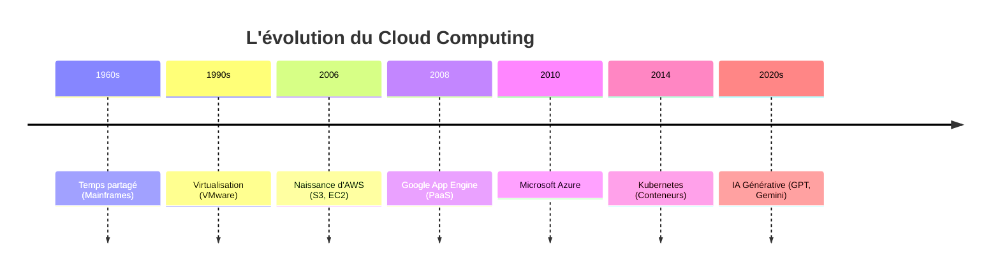

# Chapitre 2 — Évolution historique du cloud computing

## Introduction

Le cloud computing n'est pas apparu du jour au lendemain. C'est le résultat d'une convergence technologique et économique qui s'étale sur plusieurs décennies. Comprendre cette histoire permet de saisir pourquoi les hyperscalers fonctionnent comme ils le font aujourd'hui, et d'anticiper où ils vont.

---

## Chronologie du Cloud

---

## 1. Les Prémices : Le Temps Partagé (1960s)

Dans les années 60, l'informatique coûtait extrêmement cher. Un mainframe IBM pouvait coûter l'équivalent de plusieurs millions d'euros actuels.

**L'idée révolutionnaire de John McCarthy (1961) :**
> "L'informatique pourrait un jour être organisée comme un service public, comme l'électricité ou l'eau."

### Le modèle Time-Sharing
- Plusieurs utilisateurs accèdent à la même ressource de calcul **simultanément**.
- Chacun a l'illusion d'avoir la machine pour lui seul.
- C'est l'ancêtre conceptuel du multi-tenant cloud.

---

## 2. La Révolution de la Virtualisation (1990s-2000s)

### Le problème avant la virtualisation
- **1 Application = 1 Serveur physique.**
- Taux d'utilisation moyen : ~10-15%.
- Gaspillage énorme de ressources, d'espace et d'énergie.

### La solution VMware (1999)
VMware a démocratisé la virtualisation sur architecture x86 :
- **1 Serveur physique = 10 à 50 Serveurs virtuels (VMs).**
- L'abstraction du matériel devient la norme.
- Naissance des concepts de "provisioning" et de "templates".

> [!TIP]
> La virtualisation a été le catalyseur technique qui a rendu le cloud possible. Sans elle, pas de multi-tenancy efficace.

---

## 3. La Révolution AWS (2006)

Amazon, cherchant à :
1. Rentabiliser son infrastructure e-commerce sous-utilisée hors périodes de pointe.
2. Permettre à ses équipes internes de provisionner de l'infra sans attendre l'IT.

...lance **S3** (Simple Storage Service) puis **EC2** (Elastic Compute Cloud).

### Le concept disruptif
- Louer de la puissance de calcul **à l'heure**.
- **Par carte bancaire**, sans parler à un commercial.
- **Via API**, de manière programmatique.

C'est la naissance du **IaaS (Infrastructure as a Service)** moderne.

### Impact
| Avant AWS | Après AWS |
| :--- | :--- |
| Acheter des serveurs (CAPEX) | Louer des ressources (OPEX) |
| Délai : semaines/mois | Délai : minutes |
| Engagement long terme | Payer à l'usage |

---

## 4. La Guerre des Modèles (2008-2012)

### L'approche PaaS de Google (App Engine, 2008)
Google a parié que les développeurs ne voudraient plus gérer de serveurs. App Engine abstraire tout : vous déployez du code, Google gère le reste.

**Problème :** Le marché d'entreprise voulait d'abord des VMs (contrôle).

### L'approche hybride de Microsoft (Azure, 2010)
Microsoft a compris que son ADN était l'entreprise. Azure a été conçu comme une **extension du datacenter existant**, pas un remplacement.

### Convergence
Depuis 2012, les trois acteurs convergent :
- AWS ajoute du PaaS (Lambda, 2014).
- GCP ajoute de l'IaaS (Compute Engine).
- Azure équilibre les deux mondes.

---

## 5. L'ère Kubernetes et Cloud-Native (2014-2020)

### Le problème des VMs
Les VMs sont lourdes (Go de RAM, minutes de démarrage). Les microservices modernes ont besoin de plus d'agilité.

### La solution : Les Conteneurs (Docker, 2013)
- Un conteneur est une VM ultra-légère (Mo, secondes de démarrage).
- Isolation applicative sans l'overhead d'un OS complet.

### Kubernetes (2014)
Google open-source son système interne d'orchestration (Borg) sous le nom de **Kubernetes**.
- Devient le standard de facto pour déployer des conteneurs à grande échelle.
- Les trois hyperscalers proposent des services Kubernetes managés (EKS, AKS, GKE).

---

## 6. L'ère de l'IA Générative (2020s)

### Le tournant ChatGPT (2022)
L'IA passe de "fonctionnalité pour experts" à "commodité grand public".

### Impact sur le cloud
- Besoin de GPUs massifs (Nvidia A100, H100).
- Nouveaux services : Azure OpenAI, AWS Bedrock, GCP Vertex AI.
- Le cloud devient la seule façon réaliste d'accéder à la puissance de calcul IA.

---

## Synthèse : Les 4 âges du Cloud

| Ère | Période | Innovation clé | Modèle dominant |
| :--- | :--- | :--- | :--- |
| **Virtualisation** | 2000-2006 | VMs | Datacenter privé virtualisé |
| **IaaS** | 2006-2014 | APIs à la demande | Cloud public (VMs) |
| **Cloud-Native** | 2014-2022 | Conteneurs, Serverless | Kubernetes, Functions |
| **IA Cloud** | 2022-... | LLMs, GenAI | AI-as-a-Service |

---

## Ce qu'il faut retenir

> Le cloud est passé de la **mutualisation du matériel** (VMs) à la **mutualisation de l'intelligence** (APIs IA).

Chaque ère a construit sur la précédente. Comprendre cette évolution permet de prédire les tendances futures.
