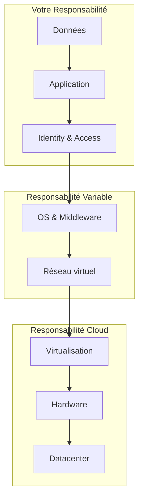

# Chapitre 3 — IaaS, PaaS, SaaS : mythes et réalités

## Introduction

Ces trois acronymes sont la base du vocabulaire cloud. Pourtant, la frontière entre eux devient de plus en plus floue avec l'émergence du Serverless, des conteneurs managés et des services hybrides. Ce chapitre démystifie ces concepts et vous donne les clés pour choisir le bon niveau d'abstraction.

---

## L'analogie de l'immobilier

Pour comprendre IaaS, PaaS et SaaS, imaginons l'informatique comme un logement :

| Modèle | Analogie | Ce que vous gérez |
| :--- | :--- | :--- |
| **On-Premises** | Construire sa maison | Tout (terrain, murs, meubles) |
| **IaaS** | Louer un terrain viabilisé | La maison et son contenu |
| **PaaS** | Louer un appartement vide | Le mobilier et la décoration |
| **SaaS** | Réserver un hôtel | Rien, juste utiliser |

---

## 1. IaaS (Infrastructure as a Service)

### Définition
"Je loue le terrain viabilisé et je construis ma maison."

Le fournisseur gère :
- ✅ Réseau physique
- ✅ Stockage physique
- ✅ Serveurs (Hardware)
- ✅ Virtualisation (Hyperviseur)

Vous gérez :
- ❌ Système d'exploitation
- ❌ Middleware / Runtime
- ❌ Données
- ❌ Application

### Exemples concrets
| Fournisseur | Service IaaS |
| :--- | :--- |
| AWS | EC2 (Elastic Compute Cloud) |
| Azure | Virtual Machines |
| GCP | Compute Engine |

### Cas d'usage typiques
- **Migration "Lift & Shift"** : Déplacer une VM on-prem vers le cloud sans la réécrire.
- **Contrôle total requis** : Applications legacy qui nécessitent des configurations OS spécifiques.
- **Personnalisation HPC** : Calcul haute performance avec des drivers personnalisés.

### Avantages et inconvénients

| ✅ Avantages | ❌ Inconvénients |
| :--- | :--- |
| Contrôle total | Responsabilité étendue (patching, sécurité OS) |
| Flexibilité maximale | Courbe d'apprentissage plus raide |
| Compatible avec l'existant | Scaling moins automatique |

---

## 2. PaaS (Platform as a Service)

### Définition
"Je loue un appartement meublé dans une résidence sécurisée."

Le fournisseur gère :
- ✅ Tout l'IaaS (Hardware, Virtualisation)
- ✅ Système d'exploitation
- ✅ Middleware / Runtime (Node.js, Python, .NET...)
- ✅ Auto-scaling, Load Balancing

Vous gérez :
- ❌ Application
- ❌ Données

### Exemples concrets
| Fournisseur | Service PaaS |
| :--- | :--- |
| AWS | Elastic Beanstalk, Lambda |
| Azure | App Service, Azure Functions |
| GCP | App Engine, Cloud Run, Cloud Functions |

### Le cas particulier du Serverless
Le Serverless (Lambda, Cloud Functions) est une forme extrême de PaaS :
- Vous ne voyez même plus de "serveur" conceptuel.
- Vous payez **par exécution**, pas par heure.
- Scalabilité instantanée de 0 à des millions d'exécutions.

### Avantages et inconvénients

| ✅ Avantages | ❌ Inconvénients |
| :--- | :--- |
| Développement rapide | Moins de contrôle (pas d'accès OS) |
| Pas de gestion infra | Potentiel vendor lock-in |
| Focus sur le code métier | Debugging parfois complexe |

---

## 3. SaaS (Software as a Service)

### Définition
"Je réserve une chambre d'hôtel tout compris."

Le fournisseur gère :
- ✅ Tout (Infra, Plateforme, Application)

Vous gérez :
- ❌ Uniquement la configuration et vos données

### Exemples concrets
- **Productivité :** Microsoft 365, Google Workspace
- **CRM :** Salesforce
- **Collaboration :** Slack, Zoom
- **Data :** Snowflake, Databricks

### Qui utilise le SaaS ?
Les **utilisateurs finaux**, pas les développeurs. Le SaaS est consommé, pas construit.

---

## 4. Le Modèle de Responsabilité Partagée

C'est le concept **le plus critique** à comprendre.

### Le piège classique
> [!CAUTION]
> **"Le cloud est sécurisé"** est un mythe dangereux.
> - Le cloud sécurise **l'infrastructure** (leur responsabilité).
> - Vous sécurisez **vos données et configurations** (votre responsabilité).

### Exemple concret : Fuite de données S3
Des milliers d'entreprises ont exposé des données sensibles sur S3... non pas parce qu'AWS était faillible, mais parce qu'elles avaient configuré leurs buckets en "public".

---

## 5. Au-delà des 3 modèles : les hybrides

### CaaS (Container as a Service)
Entre IaaS et PaaS. Vous gérez des conteneurs, pas des VMs ni du code pur.
- **Exemples :** EKS, AKS, GKE, Cloud Run.

### FaaS (Function as a Service)
Le Serverless extrême. Vous gérez des fonctions, pas des applications.
- **Exemples :** Lambda, Azure Functions, Cloud Functions.

### DBaaS (Database as a Service)
Base de données managée.
- **Exemples :** RDS, Azure SQL, Cloud SQL, DynamoDB.

---

## Synthèse : Comment choisir ?

| Critère | IaaS | PaaS | SaaS |
| :--- | :--- | :--- | :--- |
| **Contrôle** | Maximum | Moyen | Minimum |
| **Effort de gestion** | Élevé | Moyen | Nul |
| **Flexibilité** | Totale | Encadrée | Limitée |
| **Time-to-Market** | Lent | Rapide | Instantané |
| **Coût prévisible** | Variable | Variable | Fixe (licence) |

### Règle d'or
> Montez dans l'abstraction (IaaS → PaaS → SaaS) autant que votre cas d'usage le permet. Ne gérez que ce qui apporte de la valeur différenciante.

---

## Ce qu'il faut retenir

> [!IMPORTANT]
> Ne supposez jamais que le cloud est sécurisé par défaut. Vous êtes **toujours** responsable de vos données et de vos configurations d'accès.

Le choix entre IaaS, PaaS et SaaS n'est pas binaire. La plupart des architectures modernes combinent les trois.
