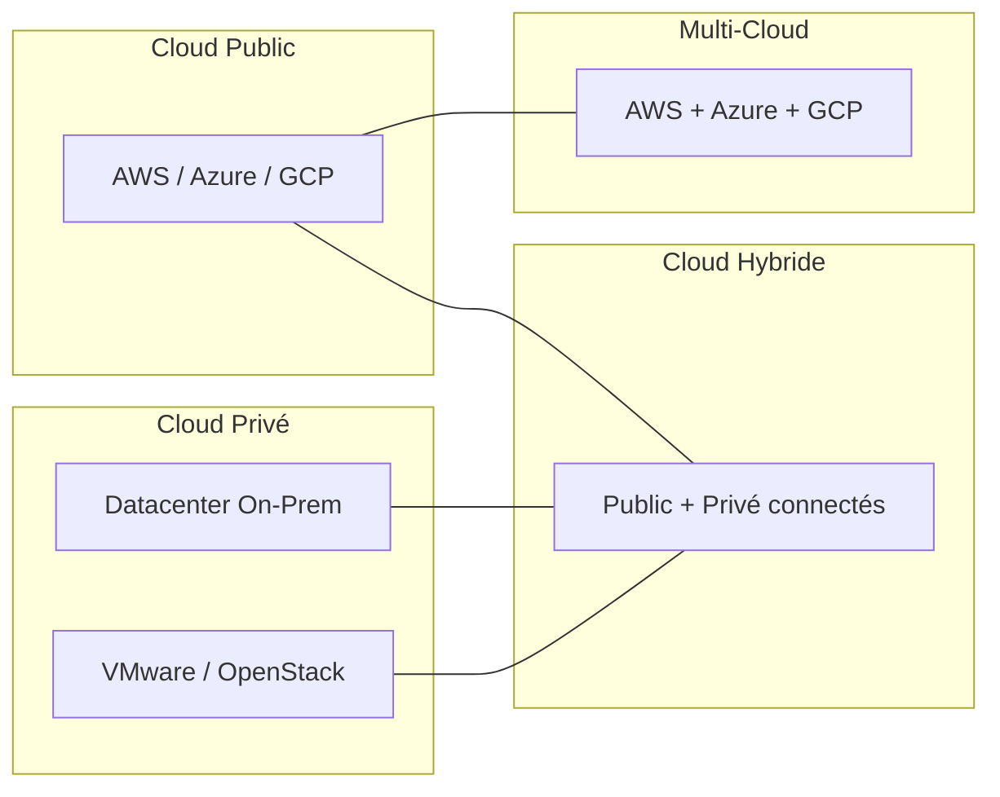
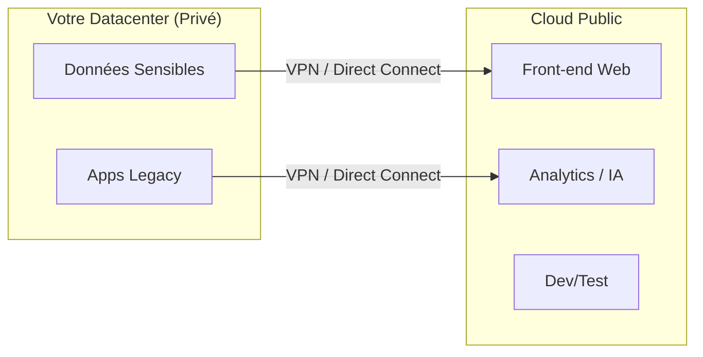
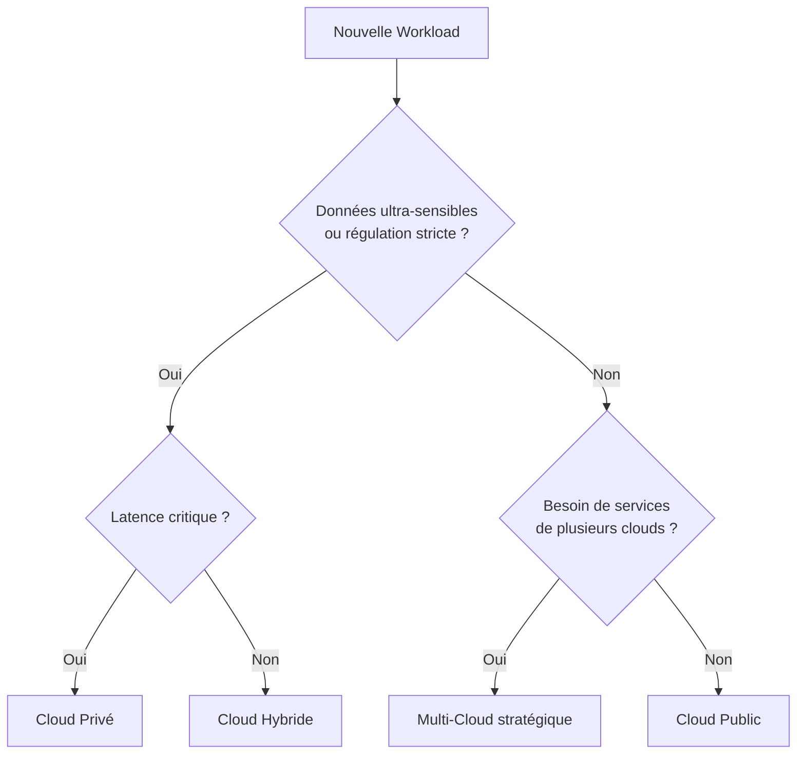

# Chapitre 4 — Cloud public, privé, hybride et multi-cloud

## Introduction

Le choix du modèle de déploiement cloud n'est pas qu'une décision technique. C'est une décision **stratégique** qui impacte votre agilité, vos coûts, votre conformité réglementaire et votre capacité d'innovation pour les années à venir. Ce chapitre vous donne les clés pour naviguer entre ces options.

---

## Vue d'ensemble des modèles

---

## 1. Cloud Public

### Définition
L'infrastructure est **partagée entre des milliers de clients** (multi-tenant) mais **isolée logiquement** par des mécanismes de virtualisation et de réseau.

### Caractéristiques clés
| Aspect | Description |
| :--- | :--- |
| **Propriétaire** | AWS, Microsoft, Google |
| **Accès** | Via Internet ou connexion privée (Direct Connect, ExpressRoute) |
| **Facturation** | À l'usage (OPEX) |
| **Élasticité** | Quasi-infinie |

### Avantages
- ✅ **Élasticité infinie** : Scalez de 1 à 10 000 serveurs en minutes.
- ✅ **Innovation constante** : Nouveaux services chaque semaine.
- ✅ **Pas de CAPEX** : Pas d'achat de matériel.
- ✅ **Présence mondiale** : Déployez dans 30+ régions instantanément.

### Inconvénients
- ❌ **Latence potentielle** : Le datacenter peut être loin de vos utilisateurs (résolu par les CDN et Edge).
- ❌ **Conformité complexe** : Pour certains secteurs (Défense, Santé), le multi-tenant pose question.
- ❌ **Egress fees** : Sortir des données du cloud coûte cher.

### Pour qui ?
- Startups (pas de capital à investir en infra).
- Entreprises en mode "Cloud First".
- Workloads variables (saisonnalité, pics de charge).

---

## 2. Cloud Privé

### Définition
L'infrastructure vous est **dédiée**. Elle peut être :
- **On-Premises** : Dans votre propre datacenter.
- **Hébergée** : Chez un tiers, mais dédiée à vous seul.

### Technologies typiques
- VMware vSphere / vCloud
- OpenStack
- Microsoft Azure Stack Hub
- AWS Outposts

### Avantages
- ✅ **Contrôle total** : Vous décidez de tout (hardware, réseau, politiques).
- ✅ **Localisation garantie** : Vos données ne quittent jamais vos murs.
- ✅ **Latence minimale** : Le datacenter est proche de vos utilisateurs/usines.

### Inconvénients
- ❌ **Coûts fixes élevés (CAPEX)** : Achat de matériel, location de salle.
- ❌ **Maintenance lourde** : Vous gérez les pannes, les mises à jour, la sécurité physique.
- ❌ **Pas d'élasticité réelle** : Si vous avez besoin de plus, il faut acheter plus.
- ❌ **Innovation lente** : Pas de nouveaux services chaque semaine.

### Pour qui ?
- Secteurs ultra-régulés (Défense, Finance, Santé avec données critiques).
- Workloads stables et prévisibles.
- Cas où la latence réseau vers le cloud public est inacceptable (usines, trading haute fréquence).

---

## 3. Cloud Hybride

### Définition
Le **"Nouvel Ordre Mondial" de l'IT**. Vous connectez votre Cloud Privé au Cloud Public de manière transparente.

### Scénarios typiques
1. **Données sensibles en local, front-end dans le cloud** : Les données client restent dans votre datacenter, mais le site web scalable est sur AWS/Azure.
2. **Burst to Cloud** : Votre datacenter gère la charge normale, le cloud absorbe les pics.
3. **Disaster Recovery** : Votre prod est on-prem, la réplication DR est dans le cloud.

### Technologies clés
| Fournisseur | Solution Hybride |
| :--- | :--- |
| AWS | Outposts, VMware Cloud on AWS |
| Azure | Azure Arc, Azure Stack |
| GCP | Anthos |

### Défis
- **Réseau** : Latence, bande passante, coût des liens dédiés (Direct Connect, ExpressRoute).
- **Identité unifiée** : Un user doit pouvoir accéder aux deux mondes avec un seul login.
- **Complexité opérationnelle** : Deux environnements à maîtriser.

---

## 4. Multi-Cloud

### Définition
Utiliser **plusieurs fournisseurs de cloud public** simultanément (ex : AWS + Azure + GCP).

### Le mythe du Multi-Cloud

> [!WARNING]
> **Mythe :** "Je fais du multi-cloud pour éviter le vendor lock-in."
>
> **Réalité :** Faire du multi-cloud pour éviter le lock-in coûte souvent **plus cher** que le lock-in lui-même.

### Pourquoi le multi-cloud est difficile
| Défi | Impact |
| :--- | :--- |
| **Complexité** | 3 consoles, 3 systèmes de facturation, 3 modèles de sécurité |
| **Compétences** | Vous avez besoin d'experts sur chaque plateforme |
| **Coûts de transfert** | Déplacer des données entre clouds est très cher (egress fees) |
| **Abstraction** | Les outils "multi-cloud" (Terraform) ne font pas tout |

### Les bonnes raisons de faire du Multi-Cloud
1. **Best of Breed** : Utiliser le meilleur de chaque cloud.
   - BigQuery (GCP) pour l'analytics.
   - Azure OpenAI pour GPT-4.
   - AWS pour l'infra générale.
2. **Acquisitions** : Votre entreprise rachète une société qui était sur un autre cloud.
3. **Exigences client** : Certains clients exigent que vous soyez sur leur cloud préféré.
4. **Résilience géopolitique** : Ne pas dépendre d'un seul fournisseur américain (cas du Cloud Souverain).

---

## 5. Synthèse comparative

| Modèle | Contrôle | Coût | Agilité | Complexité |
| :--- | :--- | :--- | :--- | :--- |
| **Public** | Faible | Variable (OPEX) | Maximale | Faible |
| **Privé** | Total | Fixe (CAPEX) | Faible | Moyenne |
| **Hybride** | Mixte | Mixte | Moyenne | Élevée |
| **Multi-Cloud** | Variable | Élevé | Variable | Très élevée |

---

## Arbre de décision

---

## Ce qu'il faut retenir

> Le choix du modèle de déploiement doit être guidé par vos **contraintes réelles** (régulation, latence, compétences) et non par des dogmes ("tout dans le cloud" ou "jamais dans le cloud").

Pour la majorité des entreprises, la réponse est : **Cloud Public par défaut, Hybride si nécessaire, Multi-Cloud avec prudence**.
