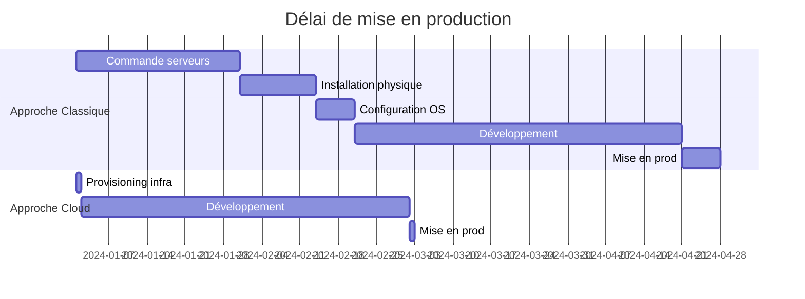

# Chapitre 5 — Le cloud comme plateforme d'innovation

## Introduction

Le cloud n'est plus seulement un moyen de réduire les coûts d'infrastructure (le fameux "Lift & Shift"). C'est devenu un **accélérateur d'innovation** qui permet aux entreprises de tester des idées plus vite, d'accéder à des technologies de pointe sans investissement massif, et de passer de l'idée à la production en quelques jours au lieu de plusieurs mois.

Ce chapitre explore comment le cloud transforme fondamentalement la façon dont les entreprises innovent.

---

## 1. Le Cloud comme démocratisateur technologique

### Avant le Cloud : Les barrières à l'innovation
| Barrière | Impact |
| :--- | :--- |
| **Capital initial** | Acheter 100 serveurs pour tester une idée = impossible pour une startup |
| **Délais** | Commander du matériel = 6 semaines à 3 mois |
| **Expertise** | Gérer un datacenter = équipe spécialisée coûteuse |
| **Risque** | Si l'idée échoue, le matériel reste |

### Après le Cloud : Les barrières tombent
| Avantage | Impact |
| :--- | :--- |
| **Coût à l'entrée nul** | Testez avec 10$ de crédits cloud |
| **Délai instantané** | Provisionnez 1000 serveurs en 5 minutes |
| **Expertise externalisée** | Le cloud gère l'infrastructure |
| **Risque minimal** | Arrêtez, vous arrêtez de payer |

---

## 2. Les géants nés du Cloud

Ces entreprises n'auraient simplement **pas pu exister** sans le cloud computing :

| Entreprise | Modèle | Pourquoi le cloud était indispensable |
| :--- | :--- | :--- |
| **Netflix** | Streaming vidéo | Pics de charge imprévisibles (soirs, week-ends), présence mondiale |
| **Airbnb** | Marketplace | Croissance explosive, besoin de scaler de 0 à des millions |
| **Uber** | Transport | Temps réel, géolocalisation, pics (Nouvel An, concerts) |
| **Spotify** | Streaming audio | Millions de streams simultanés, personnalisation ML |
| **Slack** | Communication | Croissance virale, adoption entreprise rapide |

### Le cas Netflix
Netflix est passé de 0 à 200+ millions d'abonnés en quelques années. Cela aurait nécessité :
- Des **milliers de serveurs** en propre.
- Des **dizaines de datacenters** dans le monde.
- Une **équipe d'opérations** de centaines de personnes.

Au lieu de cela, Netflix utilise AWS et se concentre sur son **cœur de métier** : le contenu et l'algorithme de recommandation.

---

## 3. L'impact sur le Time-to-Market

### Comparaison classique vs Cloud



| Métrique | Classique | Cloud |
| :--- | :--- | :--- |
| **Délai total** | ~4-6 mois | ~2 mois |
| **Risque** | Élevé (matériel acheté) | Faible |
| **Itérations** | Difficiles | Rapides |

---

## 4. Infrastructure as Code (IaC)

### Le paradigme
L'infrastructure devient du **logiciel**. On ne clique plus dans une console, on écrit du code qui déploie l'infrastructure.

### Exemple Terraform
```hcl
# Déployer une VM sur AWS en 10 lignes
resource "aws_instance" "web_server" {
  ami           = "ami-0c55b159cbfafe1f0"
  instance_type = "t3.micro"
  
  tags = {
    Name        = "MonServeurWeb"
    Environment = "Production"
  }
}
```

### Outils IaC majeurs
| Outil | Éditeur | Multi-cloud ? | Langage |
| :--- | :--- | :--- | :--- |
| **Terraform** | HashiCorp | ✅ Oui | HCL |
| **Pulumi** | Pulumi | ✅ Oui | Python, TypeScript, Go |
| **CloudFormation** | AWS | ❌ AWS only | YAML/JSON |
| **Bicep** | Microsoft | ❌ Azure only | Bicep |

### Avantages de l'IaC
- 📝 **Reproductibilité** : L'environnement de Dev est identique à la Prod.
- 🔄 **Versioning** : L'infrastructure est dans Git, avec historique.
- 🤖 **Automatisation** : CI/CD déploie l'infra automatiquement.
- 📊 **Auditabilité** : On sait exactement ce qui est déployé.

---

## 5. L'accès démocratisé aux technologies de pointe

### Avant : Réservé aux géants
Ces technologies étaient l'apanage de Google, Facebook ou Amazon :
- Machine Learning à grande échelle
- Traitement Big Data (pétaoctets)
- Reconnaissance d'images/vidéos
- Traitement du langage naturel

### Maintenant : Une API
N'importe qui peut utiliser :
| Capacité | Service cloud | Coût |
| :--- | :--- | :--- |
| Traduire un texte | AWS Translate, Azure Translator | ~$15 / million de caractères |
| Analyser une image | AWS Rekognition, GCP Vision | ~$1 / 1000 images |
| Générer du texte (GPT) | Azure OpenAI | ~$0.01 / 1000 tokens |
| Entraîner un modèle ML | SageMaker, Vertex AI | À l'heure de GPU |

---

## 6. Le Cloud comme laboratoire d'expérimentation

### Le concept de "Fail Fast"
Le cloud permet d'expérimenter des idées à faible coût :
1. **Hypothèse** : "Je pense que les utilisateurs veulent cette feature."
2. **Expérimentation** : Déployez un prototype en quelques jours.
3. **Mesure** : Collectez des données utilisateurs.
4. **Décision** : Pivoter ou persévérer.
5. **Coût de l'échec** : Quelques centaines d'euros, pas des millions.

### Exemple concret
> Une équipe veut tester un chatbot IA pour le support client.
>
> - **Sans cloud** : Acheter des serveurs GPU, recruter des ML Engineers, 6 mois de développement.
> - **Avec cloud** : Appeler l'API Azure OpenAI, prototype fonctionnel en 2 semaines, coût : 500€.

---

## 7. DevOps et Cloud : Le couple parfait

### La boucle DevOps


### Pourquoi le Cloud accélère DevOps
| Phase | Accélération cloud |
| :--- | :--- |
| **Build** | Services CI/CD managés (CodeBuild, Azure DevOps, Cloud Build) |
| **Test** | Environnements éphémères créés à la demande |
| **Deploy** | Déploiement automatisé via IaC |
| **Operate** | Services managés = moins d'opérations |
| **Monitor** | Observabilité intégrée (CloudWatch, Azure Monitor, Cloud Monitoring) |

---

## 8. Synthèse : L'IT passe de Centre de Coûts à Centre d'Innovation

| Ancien monde | Nouveau monde |
| :--- | :--- |
| L'IT gère l'infrastructure | L'IT **crée** de la valeur métier |
| Temps passé à "garder les lumières allumées" | Temps passé à innover |
| L'IT dit "Non, c'est trop cher/long" | L'IT dit "Testons rapidement" |
| Budget majoritairement CAPEX | Budget majoritairement OPEX |

---

## Ce qu'il faut retenir

> Le Cloud transforme l'IT de **"Centre de Coûts"** en **"Centre d'Innovation"**.

Les entreprises qui maîtrisent le cloud ne sont pas juste plus efficaces opérationnellement. Elles sont capables d'**expérimenter plus vite**, d'**échouer à moindre coût**, et donc d'**innover plus rapidement** que leurs concurrents.

> [!TIP]
> La vraie valeur du cloud n'est pas de faire la même chose moins cher. C'est de faire des choses qui étaient **impossibles** avant.
