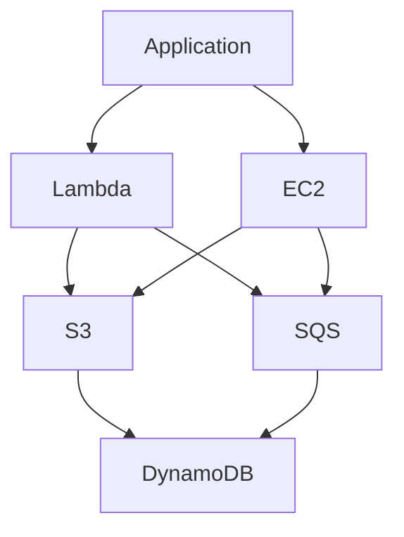
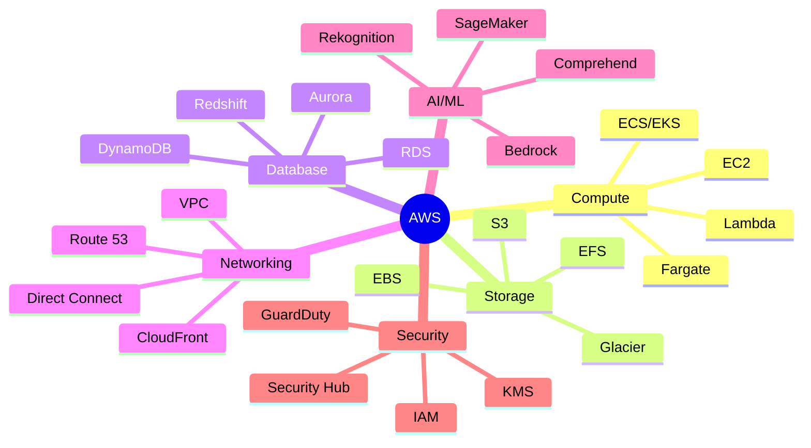

# Chapitre 6 — Genèse et philosophie d'AWS

## Introduction

Pour comprendre AWS, il faut comprendre d'où il vient. AWS n'a pas été créé pour être un fournisseur cloud. Il est né d'un **besoin interne** d'Amazon pour supporter son activité e-commerce à grande échelle. Cette origine façonne encore aujourd'hui sa philosophie et son offre.

Ce chapitre explore l'ADN d'AWS et les principes fondamentaux qui guident sa conception.

---

## 1. La genèse : Du e-commerce au cloud

### Le problème d'Amazon (2000-2004)
Amazon.com grandissait exponentiellement, mais son infrastructure interne était chaotique :
- Chaque équipe construisait sa propre infrastructure.
- Beaucoup de duplication d'efforts.
- Impossible de scaler rapidement pour les pics (Black Friday).

### La solution : Les Building Blocks
L'équipe technique d'Amazon a créé des **briques d'infrastructure standardisées** :
- **Compute** : Des serveurs provisionnables à la demande.
- **Storage** : Du stockage accessible via API.
- **Queue** : Des files de messages pour découpler les services.

### La révélation (2003-2006)
> "Si nous avons besoin de ça, d'autres entreprises aussi."

Amazon réalise qu'il peut **vendre** cette infrastructure à l'extérieur.

| Date | Événement |
| :--- | :--- |
| **Mars 2006** | Lancement de S3 (Simple Storage Service) |
| **Août 2006** | Lancement de EC2 (Elastic Compute Cloud) |
| **2006-2010** | Explosion : SQS, SimpleDB, CloudFront, RDS... |

---

## 2. La philosophie AWS : Les 4 principes fondamentaux

### Principe 1 : Tout est un service



Chaque composant (stockage, compute, base de données, file d'attente) est un **service indépendant** couplé lâchement.

- **Bénéfice** : Vous pouvez combiner les services comme des Legos.
- **Conséquence** : Vous devez comprendre les interactions entre services.

### Principe 2 : Tout est API

Il n'y a **rien** que vous puissiez faire dans la console AWS que vous ne puissiez faire via API.

```bash
# Exemple : Créer un bucket S3 via CLI
aws s3 mb s3://mon-bucket-unique-12345

# Exemple : Lancer une instance EC2
aws ec2 run-instances \
  --image-id ami-0c55b159cbfafe1f0 \
  --instance-type t3.micro
```

- **Bénéfice** : Automatisation totale possible (Infrastructure as Code).
- **Conséquence** : La courbe d'apprentissage est plus raide.

### Principe 3 : Tout est mesurable

AWS mesure tout, à une granularité extrême :
- Facturation à la **seconde** (EC2, Lambda).
- Facturation à l'**octet** (S3, Data Transfer).
- Métriques disponibles via CloudWatch pour tout service.

| Exemple de mesure | Granularité |
| :--- | :--- |
| Temps de calcul Lambda | Par milliseconde |
| Stockage S3 | Par Go/mois |
| Requêtes DynamoDB | Par lecture/écriture |
| Transfert de données | Par Go sortant |

### Principe 4 : La complexité est exposée, pas cachée

Contrairement à certains PaaS qui masquent la complexité, AWS vous donne **les clés du camion**.

**Exemple : Le réseau (VPC)**
- Vous pouvez configurer chaque sous-réseau, chaque table de routage, chaque règle de sécurité.
- C'est puissant mais nécessite une compréhension approfondie.

> [!NOTE]
> Cette philosophie "primitives exposées" est ce qui attire les ingénieurs expérimentés et peut effrayer les débutants.

---

## 3. L'obsession client

### Les Leadership Principles d'Amazon
AWS hérite de la culture Amazon, notamment :

| Principe | Application AWS |
| :--- | :--- |
| **Customer Obsession** | Les features sont guidées par les demandes clients |
| **Invent and Simplify** | Innovation constante (100+ services/an) |
| **Bias for Action** | Livrer vite, itérer |
| **Think Big** | Services conçus pour l'échelle planétaire |

### Le mécanisme "Working Backwards"
Avant de coder, les équipes AWS rédigent :
1. Un **communiqué de presse fictif** décrivant le produit fini.
2. Une **FAQ** anticipant les questions clients.

Ce processus garantit que le service répond à un vrai besoin.

---

## 4. L'écosystème AWS

### Taille actuelle (2024)
| Métrique | Valeur |
| :--- | :--- |
| **Nombre de services** | 200+ |
| **Régions** | 33+ |
| **Zones de disponibilité** | 105+ |
| **Part de marché IaaS** | ~32% |
| **Revenus annuels** | ~90 milliards $ |

### Les catégories de services


---

## 5. Les critiques et limites

### Complexité
- Plus de 200 services = courbe d'apprentissage massive.
- La documentation est exhaustive mais parfois aride.

### Coûts cachés
| Piège classique | Explication |
| :--- | :--- |
| **NAT Gateway** | ~45$/mois par gateway, nécessaire pour les subnets privés |
| **Egress fees** | 0.09$/Go pour sortir des données d'AWS |
| **Cross-AZ traffic** | Du trafic interne peut coûter cher |

### Interface utilisateur
La console AWS est fonctionnelle mais parfois perçue comme austère et overwhelming.

---

## Ce qu'il faut retenir

> AWS a été construit par des ingénieurs pour des ingénieurs. Sa philosophie de "primitives exposées" offre un contrôle maximal mais demande un investissement en apprentissage.

Les patterns qui fonctionnent sur AWS :
- ✅ **Automatiser tout** via l'API et IaC.
- ✅ **Concevoir pour la panne** (Multi-AZ, services managés).
- ✅ **Monitorer activement** les coûts dès le jour 1.

> [!TIP]
> Le mantra AWS : "Pay for what you use, but make sure you understand what you're using."
