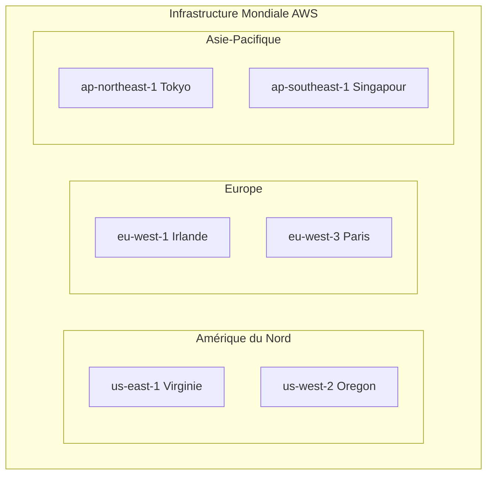
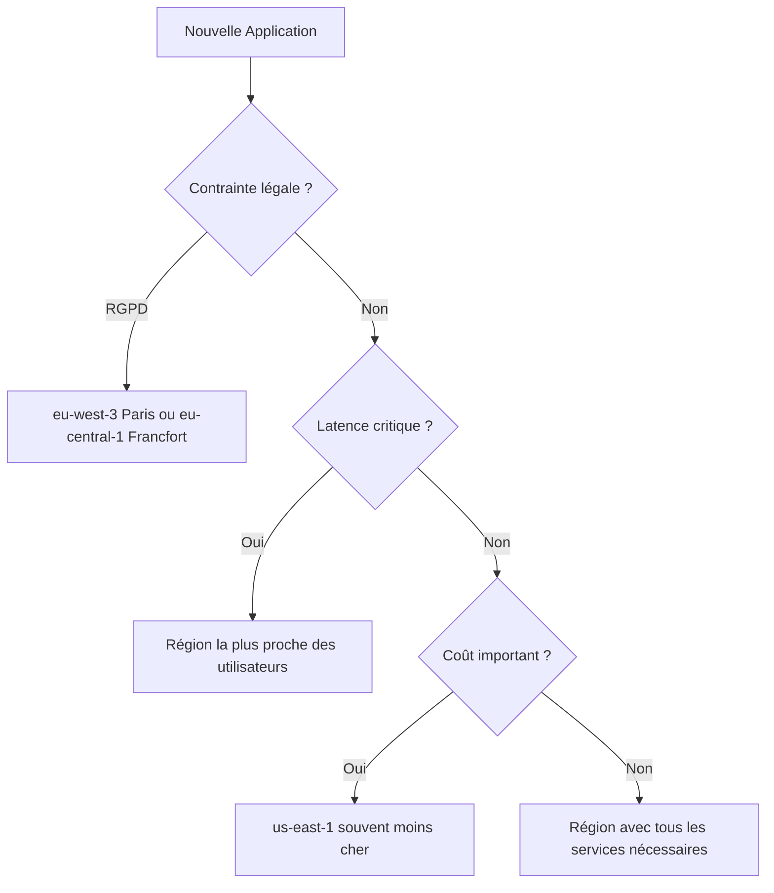
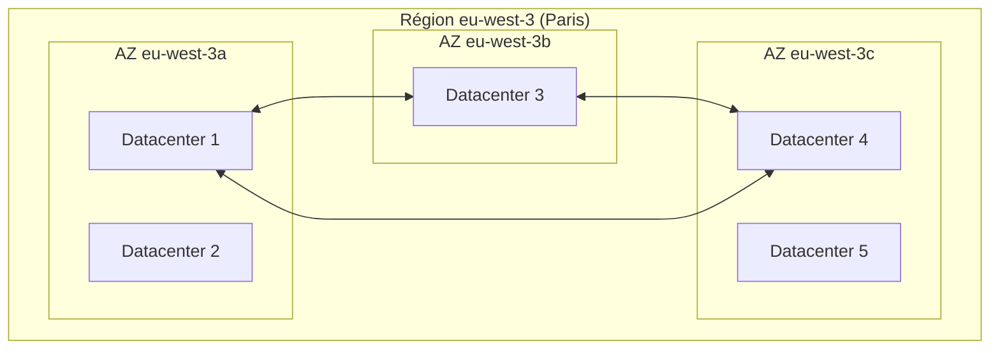
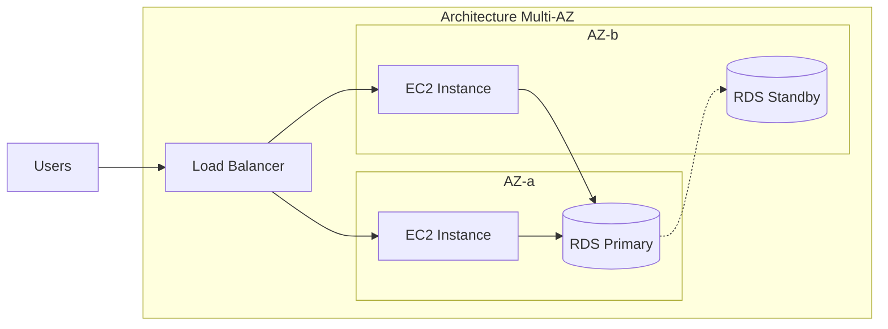
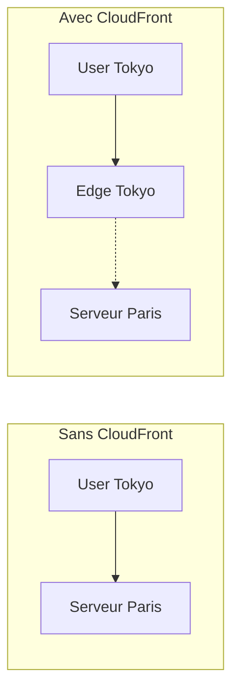
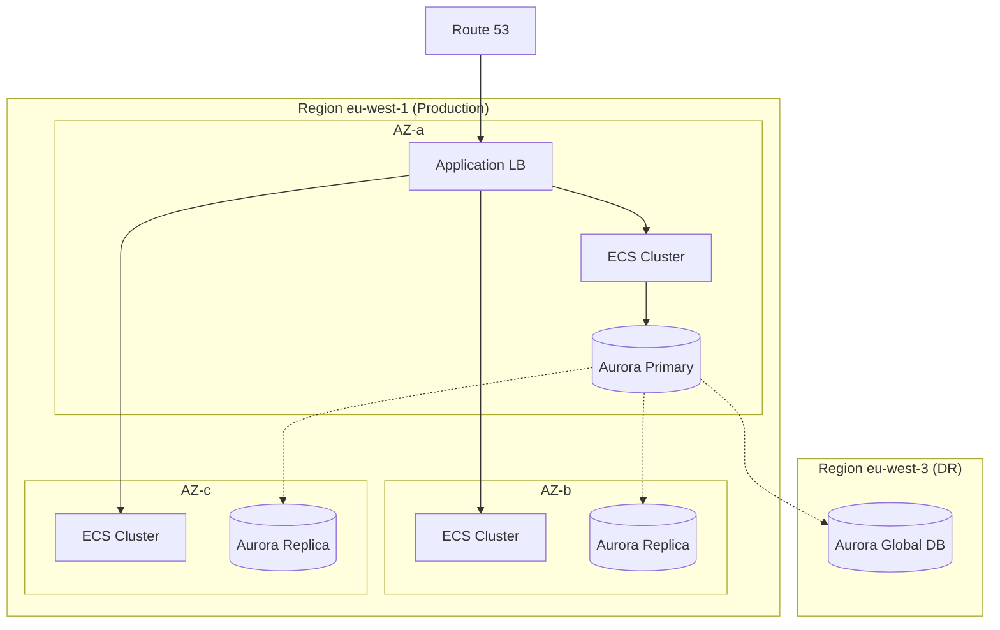

# Chapitre 7 — Architecture globale d'AWS

## Introduction

L'infrastructure AWS est probablement la plus vaste construction technique humaine. Comprendre son architecture est essentiel pour concevoir des applications résilientes et performantes. Ce chapitre décortique les concepts de régions, zones de disponibilité et points de présence qui sont au cœur de tout déploiement AWS.

---

## 1. Vue d'ensemble de l'infrastructure mondiale

### L'échelle d'AWS (2024)

| Métrique | Valeur |
|----------|--------|
| **Régions** | 33+ |
| **Zones de disponibilité** | 105+ |
| **Points de présence (Edge)** | 600+ |
| **Pays couverts** | 245+ |
| **Capacité réseau** | Pétabits/seconde |

---

## 2. Régions (Regions)

### Définition
Une **région** est une zone géographique contenant plusieurs datacenters isolés. Chaque région possède un nom de code (ex: `eu-west-3` pour Paris).

### Caractéristiques clés

| Caractéristique | Description |
|-----------------|-------------|
| **Isolation totale** | Chaque région a son propre control plane |
| **Indépendance** | Une panne dans une région n'affecte pas les autres |
| **Réplication manuelle** | Vous devez explicitement copier vos données entre régions |
| **Services variables** | Certains services ne sont pas disponibles dans toutes les régions |

### Comment choisir une région ?

### Les régions françaises et européennes

| Région | Code | Lancement | Use case |
|--------|------|-----------|----------|
| **Paris** | eu-west-3 | 2017 | Clients FR, latence FR |
| **Irlande** | eu-west-1 | 2007 | Plus ancienne, tous les services |
| **Francfort** | eu-central-1 | 2014 | Clients DACH, finance |
| **Stockholm** | eu-north-1 | 2018 | Nordics |

---

## 3. Zones de Disponibilité (Availability Zones - AZs)

### Définition
Une **zone de disponibilité** (AZ) est un ou plusieurs datacenters physiquement séparés au sein d'une région.

### Architecture d'une région

### Caractéristiques des AZs

| Aspect | Détail |
|--------|--------|
| **Distance physique** | Plusieurs kilomètres entre AZs |
| **Latence inter-AZ** | < 2ms (fibre noire dédiée) |
| **Alimentation** | Sources d'énergie indépendantes |
| **Réseau** | Connectivité redondante |
| **Refroidissement** | Systèmes séparés |

### Le pattern Multi-AZ

> [!IMPORTANT]
> **Règle d'or AWS :** Toujours déployer en Multi-AZ pour la production.

**Bénéfice :** Si l'AZ-a tombe (incendie, coupure électrique), l'application continue de fonctionner sur l'AZ-b.

---

## 4. Points de Présence (Edge Locations)

### Définition
Les **Edge Locations** sont des mini-datacenters répartis dans le monde entier, utilisés pour :
- **CloudFront** : CDN (Content Delivery Network)
- **Route 53** : DNS global
- **AWS Global Accelerator** : Optimisation du trafic

### Pourquoi l'Edge ?

| Sans Edge | Avec Edge |
|-----------|-----------|
| L'utilisateur à Tokyo charge une image depuis Paris | L'image est mise en cache à Tokyo |
| Latence : ~250ms | Latence : ~10ms |

---

## 5. Le Backbone AWS

### Le réseau privé mondial
AWS possède son propre réseau de câbles sous-marins et terrestres.

**Avantage :** Votre trafic entre Tokyo et Paris ne passe PAS par l'internet public. Il reste sur le réseau privé AWS, garantissant :
- Performance prévisible
- Latence réduite
- Sécurité renforcée

### AWS Global Accelerator vs Internet public

| Métrique | Internet public | Global Accelerator |
|----------|-----------------|-------------------|
| **Latence** | Variable (congestion) | Stable et optimisée |
| **Routage** | Best effort | Intelligent (anycast) |
| **Coût** | Standard | +15-20% |

---

## 6. Régions spéciales

### AWS GovCloud (US)
Régions isolées pour le gouvernement américain, conformes aux normes FedRAMP, ITAR, etc.

### Chine (Beijing, Ningxia)
Opérées par des partenaires locaux (Sinnet, NWCD) car AWS ne peut pas opérer directement en Chine.

### Local Zones
Mini-régions proches des grandes villes pour la latence ultra-faible (Los Angeles, Boston, etc.).

### Wavelength
AWS directement dans les antennes 5G des opérateurs télécom pour l'edge computing mobile.

---

## 7. Bonnes pratiques architecturales

### Checklist de résilience

| Niveau | Action |
|--------|--------|
| ✅ **Minimum** | Déployer en Multi-AZ |
| ✅ **Recommandé** | Activer les backups cross-region |
| ✅ **Critique** | Architecture Multi-région active-active |

### Coûts à surveiller

> [!WARNING]
> Le trafic inter-régions et inter-AZ n'est pas gratuit !

| Type de trafic | Coût approximatif |
|----------------|-------------------|
| **Intra-AZ** (même AZ) | Gratuit |
| **Inter-AZ** (même région) | ~$0.01/Go |
| **Inter-région** | ~$0.02-0.09/Go |
| **Vers Internet** | ~$0.09/Go |

---

## 8. Exemple d'architecture résiliente

---

## Ce qu'il faut retenir

> L'architecture AWS est conçue pour le **Design for Failure**. Utilisez les AZs et les régions à votre avantage.

| Concept | Utilisation |
|---------|-------------|
| **Région** | Isolation géographique, conformité, DR |
| **AZ** | Haute disponibilité, Multi-AZ obligatoire en prod |
| **Edge** | Performance utilisateur, CDN, DNS |

> [!TIP]
> Démarrez toujours en Multi-AZ. Le surcoût est minime comparé au coût d'une indisponibilité.
