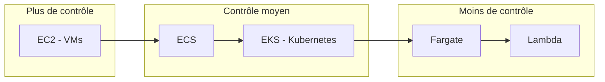
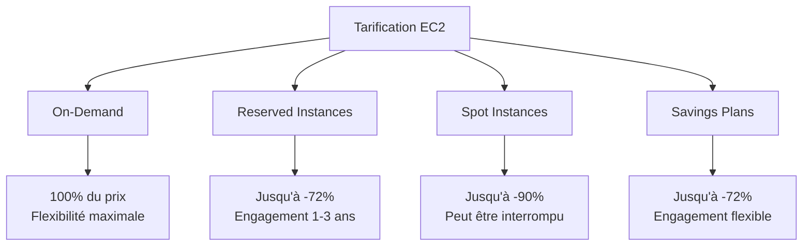
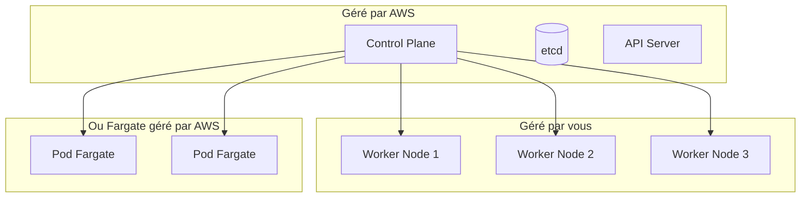
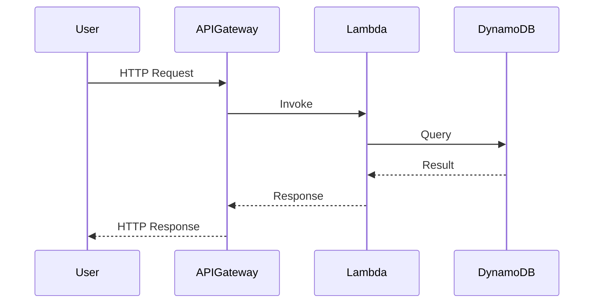
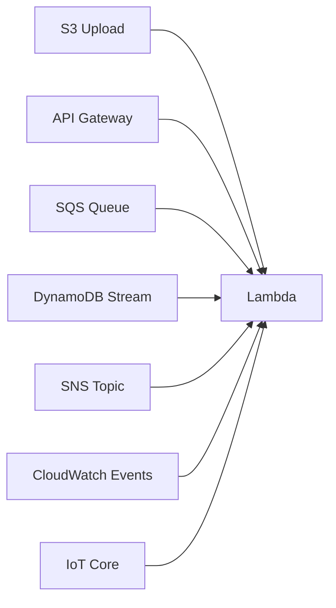
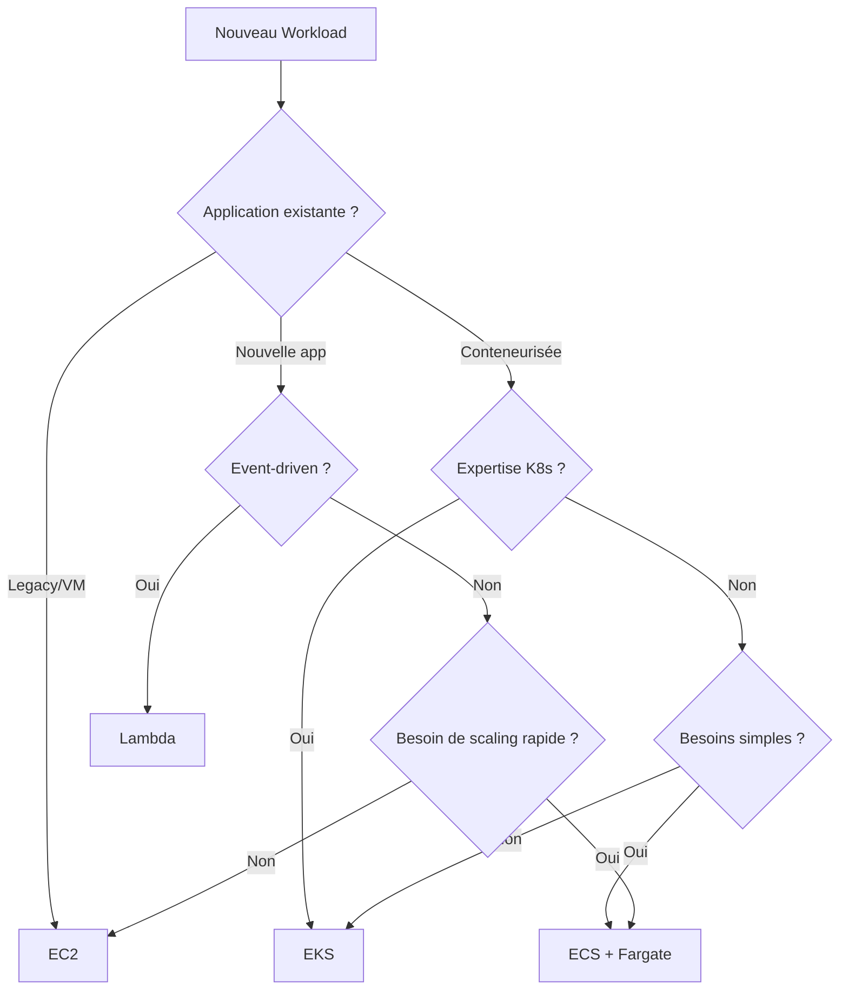

# Chapitre 8 — Compute chez AWS (EC2, EKS, Lambda)

## Introduction

Le calcul (Compute) est le cœur de tout système cloud. AWS offre le spectre le plus large de l'industrie, des machines virtuelles classiques au serverless le plus abstrait. Ce chapitre vous guide dans le choix du service adapté à chaque besoin.

---

## 1. Vue d'ensemble du Compute AWS



| Service | Abstraction | Gestion | Use Case |
|---------|-------------|---------|----------|
| **EC2** | VM complète | Vous gérez tout | Legacy, HPC, contrôle total |
| **ECS** | Conteneurs managés | AWS gère le cluster | Microservices simples |
| **EKS** | Kubernetes managé | AWS gère le control plane | Microservices K8s |
| **Fargate** | Conteneurs serverless | AWS gère les serveurs | Conteneurs sans infra |
| **Lambda** | Fonctions serverless | Rien à gérer | Event-driven, API, glue |

---

## 2. Amazon EC2 (Elastic Compute Cloud)

### Qu'est-ce qu'EC2 ?
EC2 est le service de machines virtuelles d'AWS. C'est la brique fondamentale sur laquelle tout le reste est construit.

### Types d'instances

AWS propose plus de 700 types d'instances, organisés en familles :

| Famille | Optimisation | Exemple | Use Case |
|---------|--------------|---------|----------|
| **T** | Burst | t3.micro | Dev, petites apps |
| **M** | Général | m6i.xlarge | Applications équilibrées |
| **C** | Compute | c6i.2xlarge | Calcul intensif, batch |
| **R** | Mémoire | r6i.4xlarge | Bases de données, cache |
| **P/G** | GPU | p4d.24xlarge | ML training, gaming |
| **I** | Stockage | i3.large | Bases de données IO intensif |

### Anatomie d'un nom d'instance

```
m6i.2xlarge
│││  │
│││  └── Taille (nano → metal)
││└───── Génération
│└────── Processeur (i=Intel, a=AMD, g=Graviton)
└─────── Famille
```

### Modèles de tarification



| Modèle | Économie | Engagement | Interruption |
|--------|----------|------------|--------------|
| **On-Demand** | 0% | Aucun | Non |
| **Reserved (RI)** | 30-72% | 1-3 ans | Non |
| **Spot** | 60-90% | Aucun | **Oui (2min warning)** |
| **Savings Plans** | 30-72% | 1-3 ans | Non |

### Spot Instances : L'arme secrète

Les Spot Instances utilisent la capacité inutilisée d'AWS à prix cassé.

> [!TIP]
> Utilisez Spot pour :
> - Jobs de batch
> - Entraînement ML
> - CI/CD workers
> - Workloads fault-tolerant

```python
# Exemple : Demander une Spot Instance
import boto3

ec2 = boto3.client('ec2')
response = ec2.request_spot_instances(
    InstanceCount=1,
    Type='one-time',
    LaunchSpecification={
        'ImageId': 'ami-0c55b159cbfafe1f0',
        'InstanceType': 'm5.large',
    }
)
```

---

## 3. Amazon EKS (Elastic Kubernetes Service)

### Qu'est-ce que Kubernetes ?
Kubernetes (K8s) est le standard de l'industrie pour orchestrer des conteneurs à grande échelle.

### EKS = Kubernetes managé par AWS



### EKS Node Types

| Type | Description | Gestion |
|------|-------------|---------|
| **Managed Node Groups** | Nodes EC2 gérés | AWS gère le patching |
| **Self-Managed Nodes** | Nodes EC2 classiques | Vous gérez tout |
| **Fargate** | Serverless pods | AWS gère tout |

### Quand utiliser EKS ?

✅ **Oui si :**
- Vous avez déjà une expertise Kubernetes
- Vous voulez de la portabilité multi-cloud
- Vous avez des microservices complexes

❌ **Non si :**
- Équipe petite sans expertise K8s
- Application monolithique simple
- Vous voulez du serverless pur

---

## 4. AWS Lambda (Serverless)

### Le concept Lambda
Vous uploadez du code. AWS l'exécute quand un événement survient. Zéro serveur à gérer.



### Caractéristiques Lambda

| Aspect | Valeur |
|--------|--------|
| **Langages** | Python, Node.js, Java, Go, .NET, Ruby, Custom Runtime |
| **Mémoire** | 128 Mo → 10 Go |
| **Timeout max** | 15 minutes |
| **Exécutions simultanées** | 1000 par défaut (augmentable) |
| **Facturation** | Par 1ms d'exécution |

### Exemple de fonction Lambda

```python
import json

def lambda_handler(event, context):
    """
    Fonction Lambda qui traite une requête API
    """
    name = event.get('queryStringParameters', {}).get('name', 'World')
    
    return {
        'statusCode': 200,
        'headers': {'Content-Type': 'application/json'},
        'body': json.dumps({'message': f'Hello, {name}!'})
    }
```

### Triggers Lambda



### Cold Start vs Warm Start

| Type | Latence | Cause |
|------|---------|-------|
| **Cold Start** | 100ms → 10s | Nouveau conteneur créé |
| **Warm Start** | <100ms | Conteneur réutilisé |

> [!WARNING]
> Les Cold Starts peuvent impacter les applications temps-réel. Solutions :
> - Provisioned Concurrency
> - SnapStart (Java)
> - Garder les fonctions "warm" avec des pings

---

## 5. Comparatif décisionnel

### Arbre de décision



### Tableau comparatif détaillé

| Critère | EC2 | EKS | Lambda |
|---------|-----|-----|--------|
| **Cold Start** | Minutes | Secondes | 100ms-10s |
| **Scaling** | Manuel/Auto | Pod Autoscaler | Automatique |
| **Coût minimal** | ~$8/mois | ~$73/mois (control plane) | $0 (si pas d'usage) |
| **Max durée** | Illimité | Illimité | 15 minutes |
| **Debugging** | SSH | kubectl | CloudWatch Logs |
| **État (stateful)** | Oui | Oui (avec volumes) | Non (stateless) |

---

## 6. Bonnes pratiques

### EC2
- ✅ Utilisez des Auto Scaling Groups
- ✅ Mixez On-Demand et Spot
- ✅ Utilisez Graviton (ARM) pour économiser 40%
- ❌ N'utilisez pas de t2.micro en production

### EKS
- ✅ Utilisez Karpenter pour l'autoscaling
- ✅ Sécurisez avec IRSA (IAM Roles for Service Accounts)
- ✅ Centralisez les logs avec Fluent Bit
- ❌ Ne déployez pas sans monitoring (Prometheus/Grafana)

### Lambda
- ✅ Gardez les fonctions petites et focalisées
- ✅ Utilisez des layers pour les dépendances
- ✅ Configurez le timeout approprié
- ❌ N'utilisez pas pour des tâches >15 minutes

---

## Ce qu'il faut retenir

> Le choix du compute dépend de votre **contexte** : équipe, expertise, type de workload.

| Situation | Recommandation |
|-----------|----------------|
| Migration lift & shift | EC2 |
| Équipe DevOps mature + K8s | EKS |
| Startup, développement rapide | Lambda + Fargate |
| Batch processing | EC2 Spot ou Lambda |
| API à fort trafic | Lambda + API Gateway ou EKS |

> [!TIP]
> **Règle d'or :** Montez dans l'abstraction autant que possible. EC2 n'est qu'un plan B quand les autres options ne fonctionnent pas.
