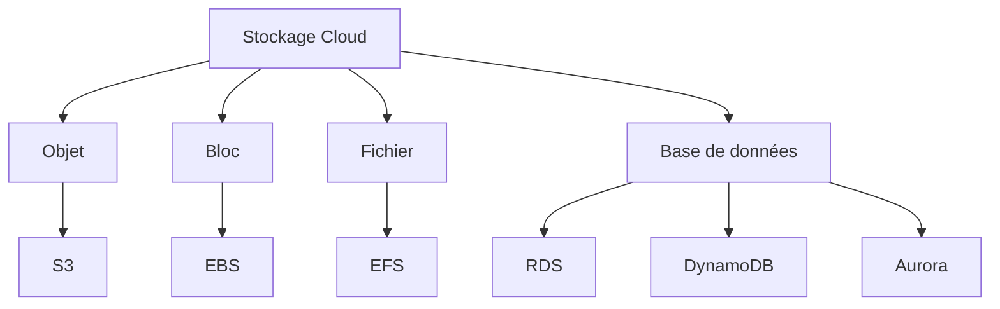
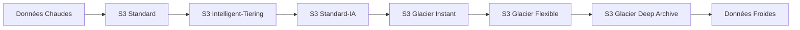
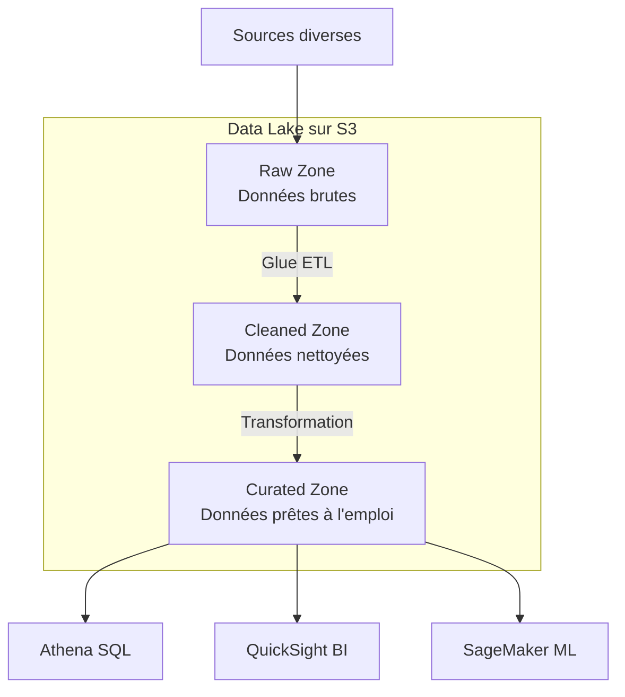
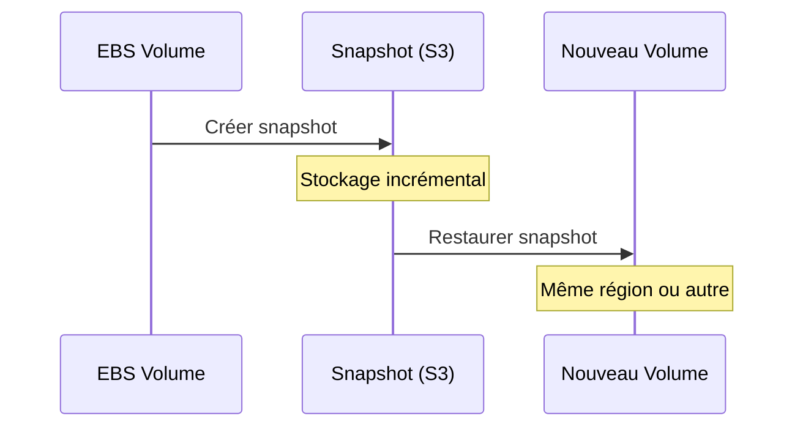
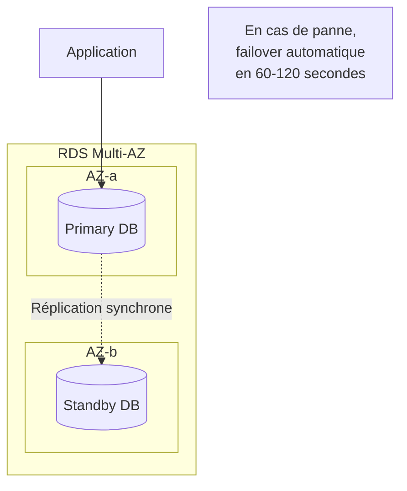
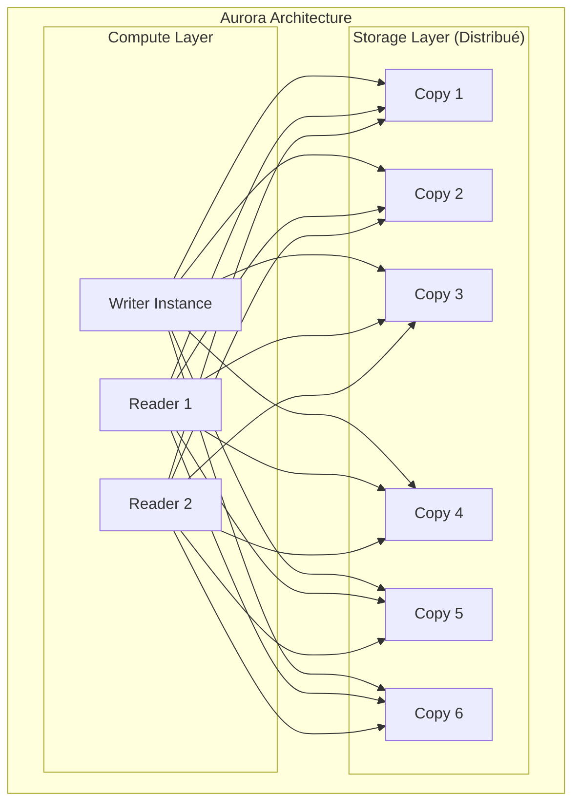
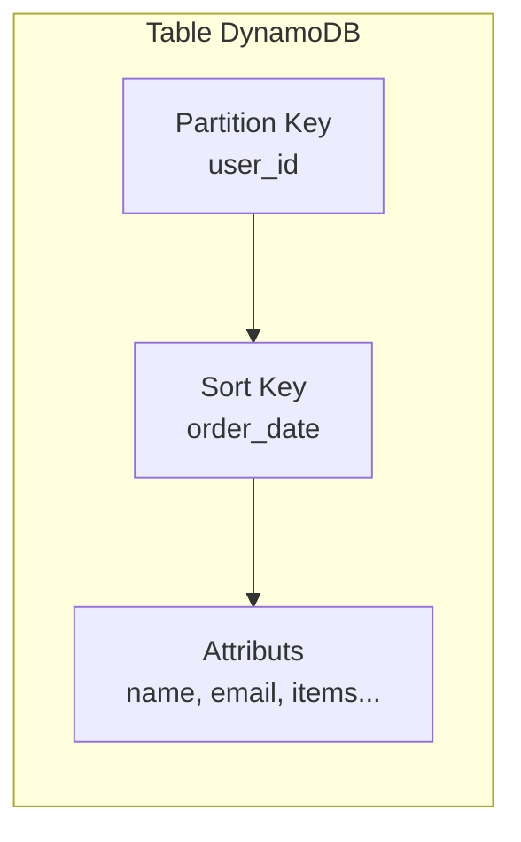
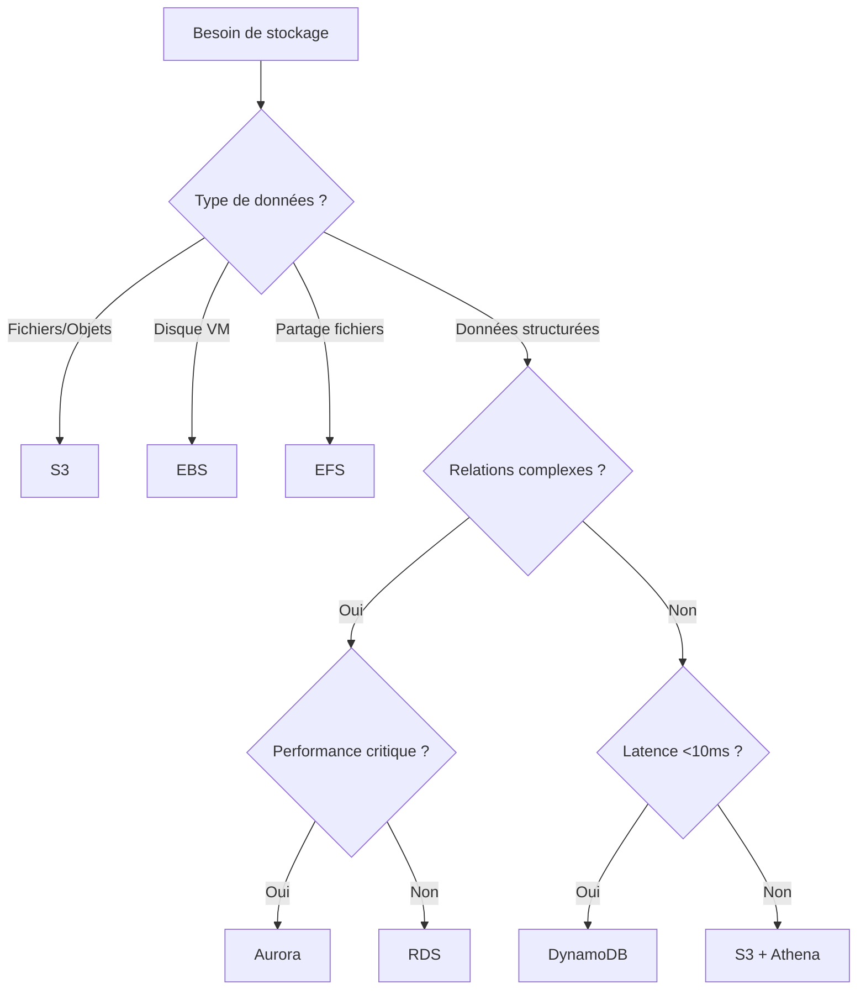

# Chapitre 9 — Stockage et données (S3, EBS, RDS, DynamoDB)

## Introduction

"Les données ont de la gravité" : une fois stockées quelque part, il devient coûteux et complexe de les déplacer. Choisir le bon service de stockage dès le départ est donc crucial. AWS offre une gamme complète, du stockage objet au relationnel en passant par le NoSQL.

---

## 1. Les types de stockage cloud



| Type | Analogie | Service AWS | Use Case |
|------|----------|-------------|----------|
| **Objet** | Disque dur USB | S3 | Fichiers, backups, data lake |
| **Bloc** | Disque dur interne | EBS | OS, bases de données |
| **Fichier** | NAS partagé | EFS | Partage entre instances |
| **BDD Relationnelle** | MySQL, PostgreSQL | RDS, Aurora | Applications transactionnelles |
| **BDD NoSQL** | Clé-valeur | DynamoDB | Haute performance, scale infini |

---

## 2. Amazon S3 (Simple Storage Service)

### Le "disque dur d'internet"
S3 est le service de stockage objet le plus utilisé au monde. Il stocke des **objets** (fichiers) dans des **buckets** (conteneurs).

### Caractéristiques exceptionnelles

| Métrique | Valeur |
|----------|--------|
| **Durabilité** | 99.999999999% (11 nines) |
| **Disponibilité** | 99.99% |
| **Taille max objet** | 5 To |
| **Objets par bucket** | Illimité |

> [!NOTE]
> "11 nines" signifie que si vous stockez 10 millions d'objets, vous pouvez vous attendre à en perdre un tous les 10 000 ans.

### Classes de stockage S3



| Classe | Latence | Coût stockage | Use Case |
|--------|---------|---------------|----------|
| **Standard** | ms | $$$ | Accès fréquent |
| **Intelligent-Tiering** | ms | $$ auto | Accès imprévisible |
| **Standard-IA** | ms | $$ | Accès rare mais immédiat |
| **Glacier Instant** | ms | $ | Archive avec accès instant |
| **Glacier Flexible** | min-heures | ¢ | Archive |
| **Deep Archive** | 12-48h | ¢¢ | Archive long terme |

### Exemple : Upload S3 avec Python

```python
import boto3

s3 = boto3.client('s3')

# Upload un fichier
s3.upload_file(
    Filename='data.csv',
    Bucket='my-bucket-unique-name',
    Key='datasets/data.csv'
)

# Générer une URL pré-signée (accès temporaire)
url = s3.generate_presigned_url(
    'get_object',
    Params={'Bucket': 'my-bucket', 'Key': 'datasets/data.csv'},
    ExpiresIn=3600  # 1 heure
)
```

### S3 et le Data Lake



---

## 3. Amazon EBS (Elastic Block Store)

### Définition
EBS fournit des volumes de stockage bloc persistant pour les instances EC2.

### Think of it as...
Le disque dur SSD accroché à votre VM.

### Types de volumes EBS

| Type | IOPS max | Throughput max | Use Case |
|------|----------|----------------|----------|
| **gp3** (SSD) | 16,000 | 1,000 MB/s | Usage général |
| **io2** (SSD) | 256,000 | 4,000 MB/s | Bases de données critiques |
| **st1** (HDD) | 500 | 500 MB/s | Big data, logs |
| **sc1** (HDD) | 250 | 250 MB/s | Archive, coût minimal |

### Snapshots EBS
Les snapshots permettent de sauvegarder vos volumes dans S3.



---

## 4. Amazon RDS (Relational Database Service)

### Base de données SQL managée
AWS gère pour vous : backups, patching, réplication, failover.

### Moteurs supportés

| Moteur | Description |
|--------|-------------|
| **MySQL** | Open source populaire |
| **PostgreSQL** | Open source avancé |
| **MariaDB** | Fork MySQL |
| **Oracle** | Enterprise (licence) |
| **SQL Server** | Microsoft (licence) |
| **Aurora** | Compatible MySQL/PostgreSQL, 5x plus rapide |

### Architecture RDS Multi-AZ



### Amazon Aurora : La pépite AWS

Aurora est la base de données relationnelle créée par AWS :

| Aspect | Aurora vs RDS classique |
|--------|------------------------|
| **Performance** | 5x MySQL, 3x PostgreSQL |
| **Stockage** | Distribué, auto-scale jusqu'à 128 To |
| **Réplication** | 6 copies sur 3 AZs |
| **Failover** | < 30 secondes |



---

## 5. Amazon DynamoDB

### Base NoSQL Key-Value managée
DynamoDB est conçue pour la performance à n'importe quelle échelle.

### Caractéristiques

| Métrique | Valeur |
|----------|--------|
| **Latence** | Single-digit milliseconds |
| **Scale** | Illimité |
| **Modèle** | Key-Value et Document |
| **Gestion** | Entièrement serverless |

### Modèle de données



### Modes de capacité

| Mode | Description | Facturation |
|------|-------------|-------------|
| **On-Demand** | Auto-scale automatique | Par requête |
| **Provisioned** | Capacité définie | RCU/WCU réservés |

### Exemple : Opérations DynamoDB

```python
import boto3

dynamodb = boto3.resource('dynamodb')
table = dynamodb.Table('Users')

# Écriture
table.put_item(Item={
    'user_id': 'user123',
    'name': 'John Doe',
    'email': 'john@example.com'
})

# Lecture
response = table.get_item(Key={'user_id': 'user123'})
user = response.get('Item')

# Query (avec Sort Key)
response = table.query(
    KeyConditionExpression='user_id = :uid',
    ExpressionAttributeValues={':uid': 'user123'}
)
```

### DynamoDB Global Tables
Réplication multi-région active-active pour les applications mondiales.

---

## 6. Arbre de décision : Quel stockage choisir ?



---

## 7. Bonnes pratiques

### S3
- ✅ Activez le versioning pour les données critiques
- ✅ Utilisez les classes de stockage intelligemment (Lifecycle Rules)
- ✅ Chiffrez par défaut (SSE-S3 ou SSE-KMS)
- ❌ Ne rendez JAMAIS un bucket public sauf nécessité absolue

### RDS/Aurora
- ✅ Activez Multi-AZ en production
- ✅ Configurez les backups automatiques
- ✅ Utilisez des Read Replicas pour scaler les lectures
- ❌ N'utilisez pas d'instances sous-dimensionnées en prod

### DynamoDB
- ✅ Modélisez vos données pour vos patterns d'accès
- ✅ Utilisez le mode On-Demand si le trafic est imprévisible
- ✅ Activez les backups continus (Point-in-Time Recovery)
- ❌ N'utilisez pas de Scan (full table) en production

---

## Ce qu'il faut retenir

> **Règle d'or :** Ne mettez jamais une base de données sur une instance EC2 vous-même, sauf si vous êtes DBA expert. Utilisez les services managés.

| Besoin | Service |
|--------|---------|
| Stockage fichiers illimité | S3 |
| Disque pour VM | EBS |
| Base SQL managée | RDS ou Aurora |
| NoSQL ultra-performant | DynamoDB |
| Data Lake | S3 + Glue + Athena |
