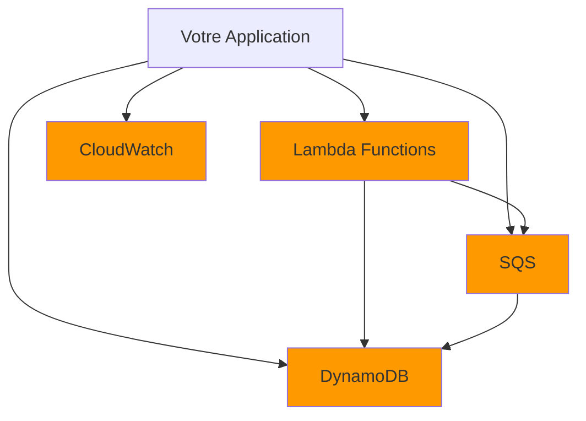
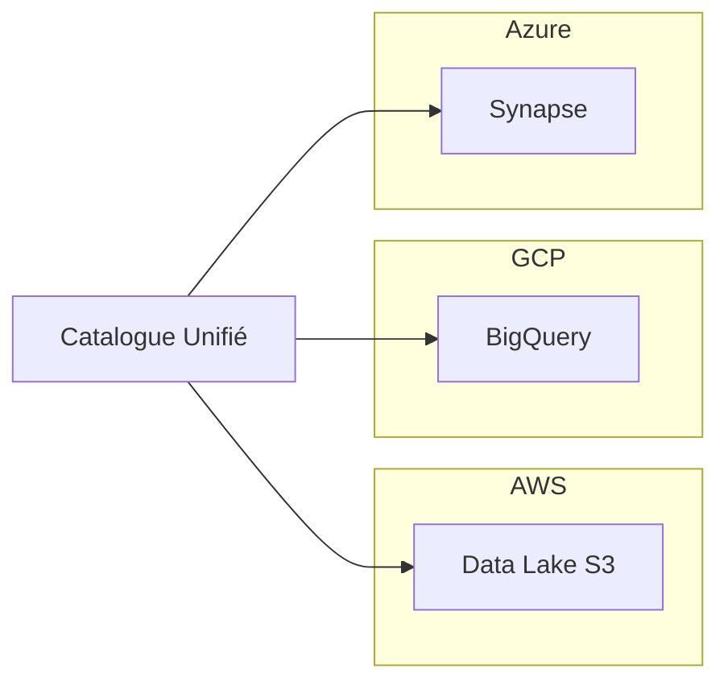

# Chapitre 32 — Multi-cloud : réalité ou mythe ?

## Introduction

Le multi-cloud est l'un des sujets les plus débattus dans l'industrie. Certains le présentent comme LA solution pour éviter le vendor lock-in, d'autres comme une complexité inutile. Ce chapitre analyse objectivement les réalités, les mythes et les cas où le multi-cloud fait véritablement sens.

---

## 1. Définition précise

### Ce qu'est le Multi-Cloud
Utiliser **plusieurs fournisseurs de cloud public** simultanément pour des workloads de production.

### Ce que le Multi-Cloud n'est PAS
| Confusion courante | Réalité |
| :--- | :--- |
| "J'utilise SaaS sur plusieurs clouds" | Ce n'est pas du multi-cloud, c'est du multi-SaaS |
| "J'ai un DR sur un autre cloud" | C'est du multi-cloud, mais limité |
| "J'utilise un cloud + on-prem" | C'est du cloud hybride, pas multi-cloud |

---

## 2. Les promesses du Multi-Cloud

### Promesse 1 : Éviter le Vendor Lock-in
> "Si AWS augmente ses prix, je migre vers Azure"

### Promesse 2 : Best of Breed
> "Je prends le meilleur de chaque cloud"

### Promesse 3 : Résilience
> "Si un cloud tombe, j'ai l'autre"

### Promesse 4 : Négociation
> "Je peux mettre les fournisseurs en concurrence"

---

## 3. La réalité du terrain

### Réalité 1 : Le Lock-in est souvent inévitable

Si vous utilisez les services natifs (Lambda, DynamoDB), vous êtes de facto verrouillé. Et **c'est souvent la bonne décision** car ces services sont puissants.

### Réalité 2 : Le coût de l'abstraction

| Niveau d'abstraction | Coût | Productivité |
| :--- | :--- | :--- |
| **Services natifs** (Lambda, Cloud Run) | Optimal | Maximale |
| **Kubernetes partout** | +30-50% | Bonne |
| **Abstraction multi-cloud totale** | +50-100% | Réduite |

> [!WARNING]
> Abstraire pour être "cloud-agnostic" coûte cher et réduit l'accès aux innovations.

### Réalité 3 : La complexité opérationnelle

Avec le multi-cloud :
- 3 modèles de facturation à comprendre.
- 3 consoles différentes.
- 3 systèmes IAM différents.
- Des équipes formées sur 3 plateformes.
- Des coûts de transfert de données entre clouds.

### Réalité 4 : Le Data Gravity

Les données ont une "gravité" : une fois stockées quelque part, il est coûteux de les déplacer.

| Volume de données | Coût pour sortir d'AWS (0.09$/Go) |
| :--- | :--- |
| 1 To | ~90$ |
| 100 To | ~9 000$ |
| 1 Po | ~90 000$ |

---

## 4. Les VRAIES bonnes raisons de faire du Multi-Cloud

### Raison 1 : Best of Breed stratégique
Utiliser le meilleur de chaque cloud pour des besoins précis :

| Besoin | Meilleur choix | Pourquoi |
| :--- | :--- | :--- |
| Data Warehouse | BigQuery (GCP) | Le plus rapide, serverless |
| IA Générative (GPT) | Azure OpenAI | Accès exclusif à GPT-4 |
| E-commerce mondial | AWS | Écosystème le plus mature |
| Entreprise Microsoft | Azure | Intégration AD/Office |

### Raison 2 : Contraintes clients
Certains clients exigent :
- Leurs données sur leur cloud préféré.
- Des SLA spécifiques.

### Raison 3 : Acquisitions
Vous rachetez une entreprise sur Azure alors que vous êtes sur AWS.

### Raison 4 : Souveraineté / Géopolitique
Ne pas mettre tous ses œufs dans le panier d'un seul pays (USA).

---

## 5. Patterns Multi-Cloud pragmatiques

### Pattern 1 : Data Mesh Multi-Cloud
Les données restent sur leur cloud d'origine, mais sont accessibles partout.

### Pattern 2 : Kubernetes comme couche d'abstraction
Déployer sur EKS, AKS et GKE avec les mêmes manifests.

**Limites :**
- La couche réseau diffère.
- Les load balancers diffèrent.
- L'observabilité diffère.

### Pattern 3 : Multi-Cloud Actif-Passif (DR)
- Production sur Cloud A.
- Disaster Recovery sur Cloud B (données répliquées).

---

## 6. Synthèse : Quand faire du Multi-Cloud ?

| Situation | Recommandation |
| :--- | :--- |
| Startup greenfield | ❌ Un seul cloud |
| Entreprise avec legacy | ⚠️ Hybride d'abord |
| Besoins best-of-breed clairs | ✅ Multi-cloud ciblé |
| Contraintes réglementaires strictes | ✅ Multi-cloud souverain |
| "Au cas où" | ❌ Pas de multi-cloud préventif |

---

## Ce qu'il faut retenir

> Le multi-cloud est un **moyen**, pas une **fin**. Il doit être justifié par des contraintes réelles, pas par la peur du lock-in.

> [!IMPORTANT]
> **Règle d'or :** Acceptez le lock-in sur les APIs (vous gagnez en productivité). Évitez le lock-in sur les données (formats ouverts : Parquet, Iceberg).
