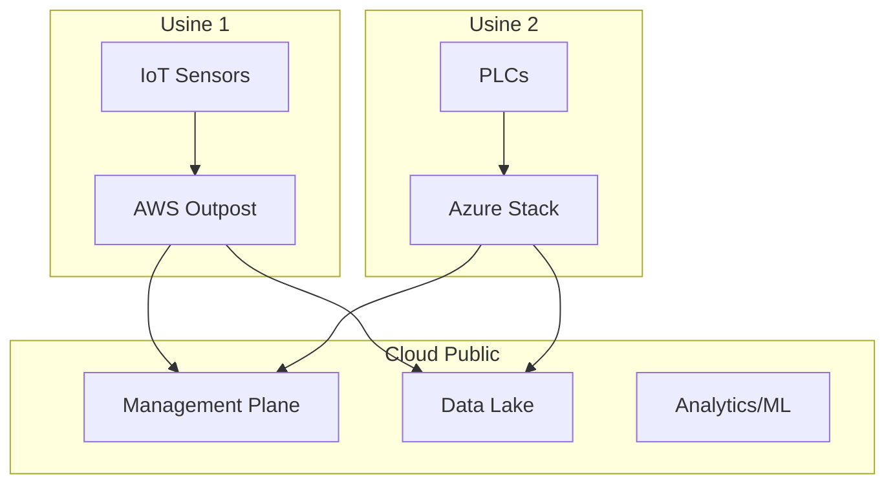
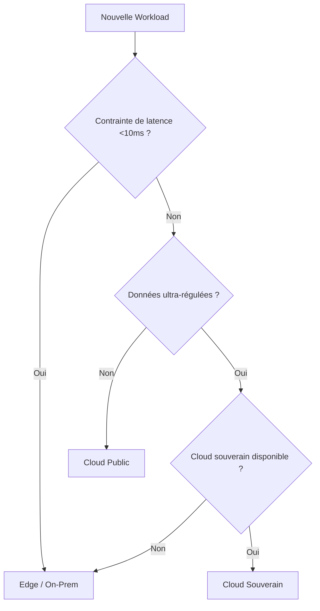

# Chapitre 33 — Cloud hybride et on-prem moderne

## Introduction

Malgré l'essor du cloud public, la majorité des grandes entreprises continuent d'opérer des workloads on-premises. Le "tout cloud" est un mythe pour ces organisations. Le cloud hybride représente un équilibre pragmatique entre l'innovation du cloud public et les contraintes du monde réel.

---

## 1. Pourquoi le On-Prem existe encore

### Raisons légitimes
| Raison | Exemple |
| :--- | :--- |
| **Régulation** | Données bancaires ne pouvant pas quitter le pays |
| **Latence** | Usine nécessitant <1ms de temps de réponse |
| **Investissements existants** | Datacenters amortis sur 10 ans |
| **Souveraineté** | Défense, nucléaire |

### Raisons discutables
| Raison | Réalité |
| :--- | :--- |
| "Le cloud coûte trop cher" | Souvent faux si bien architecturé |
| "On ne fait pas confiance au cloud" | Les hyperscalers sont plus sécurisés |
| "Nos apps ne sont pas compatibles" | La plupart peuvent être migrées |

---

## 2. Architectures hybrides types

### Architecture 1 : Extension du cloud vers le edge

### Architecture 2 : DR hybride
- Production principale on-prem.
- Réplication vers le cloud pour le Disaster Recovery.

### Architecture 3 : Burst to Cloud
- Charge normale on-prem.
- Pics de charge absorbés par le cloud.

---

## 3. Technologies d'extension cloud

### AWS
| Produit | Description |
| :--- | :--- |
| **Outposts** | Racks AWS livrés dans votre datacenter |
| **Local Zones** | AWS proche de vos utilisateurs (hors régions) |
| **Wavelength** | AWS dans les antennes 5G des opérateurs |

### Azure
| Produit | Description |
| :--- | :--- |
| **Azure Stack Hub** | Azure dans votre datacenter |
| **Azure Stack HCI** | Hyperconvergé avec Azure |
| **Azure Arc** | Gérer des serveurs anywhere comme s'ils étaient dans Azure |

### GCP
| Produit | Description |
| :--- | :--- |
| **Anthos** | Kubernetes partout (on-prem, AWS, Azure, GCP) |
| **Distributed Cloud** | GCP dans votre datacenter |

---

## 4. Les défis de l'hybride

### Défi 1 : Réseau
| Aspect | Complexité |
| :--- | :--- |
| Latence | VPN vs ExpressRoute vs Direct Connect |
| Bande passante | Dimensionner correctement |
| Coût | Liens dédiés = coûteux |

### Défi 2 : Identité unifiée
Un utilisateur doit pouvoir accéder aux deux mondes avec un seul login.
- **Solution Azure :** Entra ID sync avec AD on-prem.
- **Solution AWS :** Identity Center + SAML.

### Défi 3 : Observabilité unifiée
Avoir une vue consolidée des logs/métriques des deux environnements.
- Outils : Datadog, Splunk, Grafana, Azure Monitor.

---

## 5. Modèle de décision

---

## Ce qu'il faut retenir

> Le cloud hybride n'est pas un échec de la migration cloud. C'est souvent la **bonne architecture** pour les grandes entreprises avec des contraintes réelles.

L'objectif est de maximiser le cloud public là où c'est possible, et de garder le on-prem uniquement là où c'est nécessaire.
