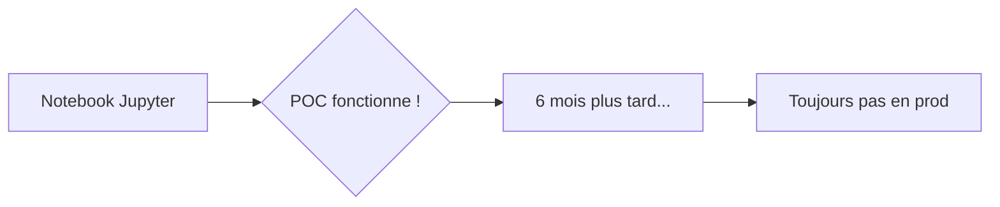
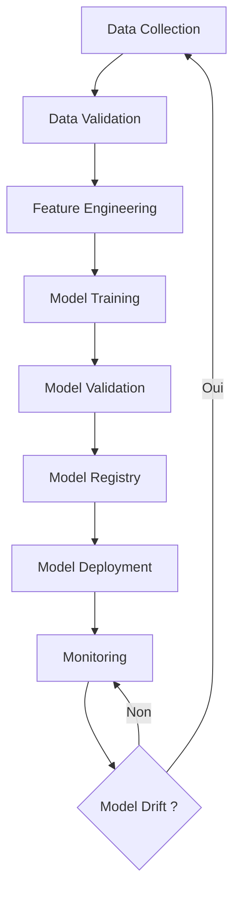
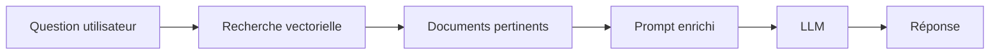

# Chapitre 34 — MLOps et pipelines IA cloud-native

## Introduction

Le Machine Learning n'est plus une expérience de laboratoire. Pour générer de la valeur, les modèles doivent être déployés, surveillés et mis à jour en continu. Le **MLOps** est la discipline qui industrialise le cycle de vie ML, et le cloud est son terrain de jeu naturel.

---

## 1. Le problème du ML en production

### Le fossé entre Data Science et Production

**Pourquoi ?**
- Le code du notebook n'est pas productionizable.
- Les données d'entraînement diffèrent des données réelles.
- Pas de monitoring de la performance du modèle.
- Pas de processus de réentraînement.

---

## 2. Le cycle de vie MLOps

### Les étapes clés
| Étape | Description | Outil cloud typique |
| :--- | :--- | :--- |
| **Data Validation** | Vérifier la qualité des données | Great Expectations, TFX |
| **Feature Store** | Stocker les features réutilisables | AWS Feature Store, Vertex AI Feature Store |
| **Training** | Entraîner le modèle | SageMaker, Vertex AI, Azure ML |
| **Registry** | Stocker les versions du modèle | MLflow, Model Registry |
| **Deployment** | Servir le modèle | SageMaker Endpoints, Cloud Run, Azure ML |
| **Monitoring** | Détecter le drift | WhyLabs, Evidently, services natifs |

---

## 3. Plateformes MLOps des hyperscalers

### AWS : SageMaker
- Suite complète : préparation, entraînement, déploiement.
- SageMaker Pipelines pour l'orchestration.
- SageMaker Model Monitor pour la détection du drift.

### GCP : Vertex AI
- Intégration forte avec BigQuery.
- Vertex AI Pipelines (basé sur Kubeflow).
- AutoML pour le no-code.

### Azure : Azure Machine Learning
- Intégration avec Azure DevOps.
- Designer visuel pour créer des pipelines.
- Responsible AI pour l'explicabilité.

---

## 4. L'IA Générative en production

### Différences avec le ML classique
| Aspect | ML Classique | GenAI (LLMs) |
| :--- | :--- | :--- |
| **Entraînement** | Vous le faites | Pré-entraîné |
| **Fine-tuning** | Souvent nécessaire | Optionnel (prompting) |
| **Données** | Vos données | Données internet |
| **Coût inference** | Faible | Élevé (tokens) |

### Pattern RAG (Retrieval Augmented Generation)

Le RAG permet d'injecter vos données privées dans un LLM sans le réentraîner.

---

## 5. Bonnes pratiques MLOps

| Pratique | Importance |
| :--- | :--- |
| **Versionner les données** | Aussi important que le code |
| **Versionner les modèles** | Registry obligatoire |
| **Tester les modèles** | Tests unitaires, tests de performance |
| **Monitorer en continu** | Détecter le drift avant les utilisateurs |
| **Automatiser le réentraînement** | Pipeline déclenché automatiquement |

---

## Ce qu'il faut retenir

> Le MLOps est au ML ce que le DevOps est au développement logiciel : l'industrialisation.

Sans MLOps, les modèles ML restent dans les notebooks. Avec MLOps, ils génèrent de la valeur en production.
