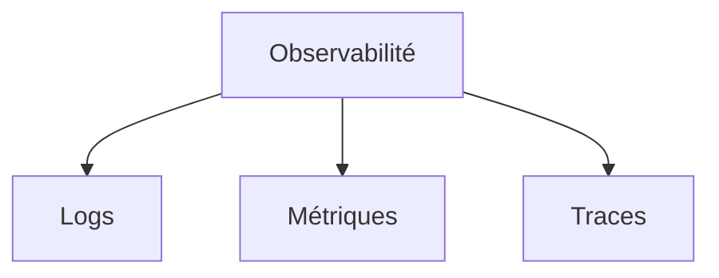
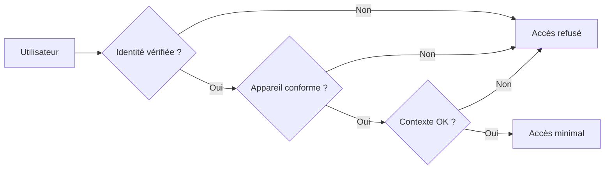

# Chapitre 35 — Observabilité, sécurité et conformité

## Introduction

Une architecture cloud moderne n'est complète que si elle est **observable** (on sait ce qui se passe), **sécurisée** (on protège les actifs) et **conforme** (on respecte les régulations). Ces trois piliers sont souvent sous-estimés lors de la conception initiale.

---

## 1. Observabilité : Les 3 piliers

### Définition
L'observabilité est la capacité à comprendre l'état interne d'un système à partir de ses sorties.

### Les 3 piliers

| Pilier | Question | Exemple |
| :--- | :--- | :--- |
| **Logs** | Que s'est-il passé ? | "Erreur 500 à 14:32:15" |
| **Métriques** | Quel est l'état global ? | "CPU à 85%, latence P99 = 200ms" |
| **Traces** | Quel chemin a pris la requête ? | "User → API → DB → Cache → Response" |

### Outils par cloud
| Pilier | AWS | Azure | GCP |
| :--- | :--- | :--- | :--- |
| Logs | CloudWatch Logs | Log Analytics | Cloud Logging |
| Métriques | CloudWatch Metrics | Azure Monitor | Cloud Monitoring |
| Traces | X-Ray | Application Insights | Cloud Trace |

### Outils multi-cloud
- Datadog
- Grafana + Prometheus
- Splunk
- New Relic

---

## 2. Sécurité : Le modèle Zero Trust

### Principe
> "Ne jamais faire confiance, toujours vérifier."

Traditionnellement, tout ce qui était "à l'intérieur du réseau" était considéré comme sûr. Le Zero Trust élimine cette notion.

### Implémentation

### Principes clés
| Principe | Description |
| :--- | :--- |
| **Least Privilege** | Donner le minimum de droits nécessaires |
| **Microsegmentation** | Isoler chaque workload |
| **Continuous Verification** | Re-vérifier à chaque accès |
| **Assume Breach** | Concevoir comme si on était déjà compromis |

---

## 3. Conformité : Les frameworks majeurs

### Régulations par secteur
| Secteur | Régulation | Exigence clé |
| :--- | :--- | :--- |
| **Données personnelles** | GDPR | Consentement, droit à l'oubli |
| **Santé** | HIPAA | Protection des données de santé |
| **Finance** | PCI-DSS | Sécurisation des paiements |
| **Gouvernement FR** | SecNumCloud | Souveraineté |

### Certifications des hyperscalers
Les trois hyperscalers sont certifiés sur les frameworks majeurs (ISO 27001, SOC 2, PCI-DSS, HIPAA...).

> [!IMPORTANT]
> La certification du cloud ne vous rend pas automatiquement conforme. Vous devez implémenter les contrôles de votre côté.

---

## 4. Implémentation pratique

### Checklist sécurité minimum
- [ ] MFA activé sur tous les comptes admin
- [ ] Rotation automatique des secrets
- [ ] Chiffrement au repos et en transit
- [ ] Least privilege IAM
- [ ] Logs d'audit centralisés
- [ ] Scan de vulnérabilités automatisé

### Outils de conformité
| Outil | Description |
| :--- | :--- |
| AWS Security Hub | Vue consolidée sécurité |
| Azure Defender for Cloud | CSPM + Detection |
| GCP Security Command Center | Posture management |

---

## Ce qu'il faut retenir

> L'observabilité, la sécurité et la conformité ne sont pas des "add-ons". Elles doivent être intégrées dès la conception (Security by Design).

Une architecture non observable est une bombe à retardement. Une architecture non sécurisée est une faille. Une architecture non conforme est un risque juridique.
