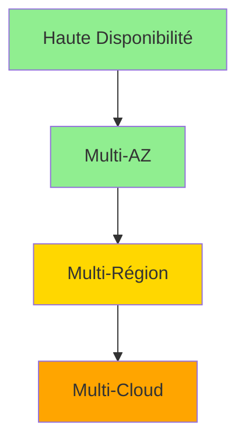
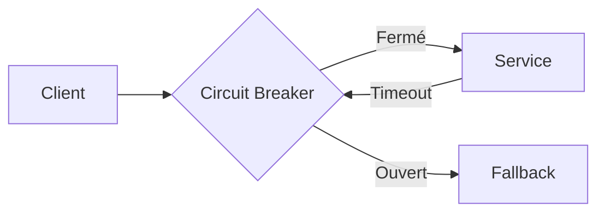
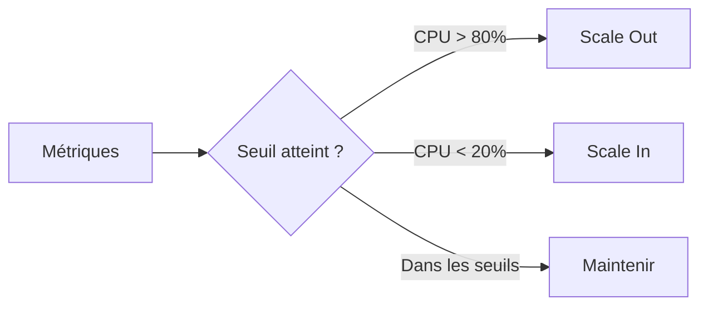

# Chapitre 36 — Résilience, scalabilité et chaos engineering

## Introduction

Le cloud offre les outils pour construire des systèmes hautement résilients et scalables. Mais ces propriétés ne sont pas automatiques. Elles doivent être **conçues** et **testées**. Ce chapitre explore les patterns de résilience et l'approche révolutionnaire du Chaos Engineering.

---

## 1. Résilience : Les concepts fondamentaux

### Définition
La résilience est la capacité d'un système à **continuer de fonctionner** malgré les pannes.

### Les niveaux de résilience

| Niveau | SLA typique | Complexité | Coût |
| :--- | :--- | :--- | :--- |
| Single-AZ | 99.9% | Basse | $ |
| Multi-AZ | 99.95% | Moyenne | $$ |
| Multi-Région | 99.99% | Haute | $$$ |
| Multi-Cloud | 99.999% | Très haute | $$$$ |

### Patterns de résilience

#### Circuit Breaker
Évite d'envoyer des requêtes à un service défaillant.

#### Retry avec Backoff
Retenter les requêtes avec un délai exponentiel.

#### Bulkhead
Isoler les ressources pour éviter qu'une panne n'affecte tout le système.

---

## 2. Scalabilité : Horizontal vs Vertical

### Scalabilité verticale (Scale Up)
Ajouter plus de ressources à une seule machine.
- ✅ Simple
- ❌ Limité (il y a un max de RAM/CPU)
- ❌ Single point of failure

### Scalabilité horizontale (Scale Out)
Ajouter plus de machines.
- ✅ Illimité théoriquement
- ✅ Résilient (pas de SPOF)
- ❌ Plus complexe (stateless requis)

### Auto-Scaling

| Service | AWS | Azure | GCP |
| :--- | :--- | :--- | :--- |
| VMs | Auto Scaling Groups | VM Scale Sets | Managed Instance Groups |
| Containers | ECS/EKS Autoscaling | AKS HPA | GKE Autoscaling |
| Serverless | Lambda (auto) | Functions (auto) | Cloud Run (auto) |

---

## 3. Chaos Engineering

### Origine
Netflix a inventé le Chaos Engineering avec **Chaos Monkey** : un outil qui tue aléatoirement des instances de production.

> "If you want to find weaknesses, break things on purpose."

### Principes
1. **Définir un état stable** (métriques normales).
2. **Hypothèse** : "Notre système survivra à X".
3. **Injection de panne** (kill instance, saturer réseau, etc.).
4. **Observer** : L'état stable est-il maintenu ?
5. **Améliorer** si nécessaire.

### Outils de Chaos Engineering
| Outil | Description |
| :--- | :--- |
| **AWS Fault Injection Simulator** | Service managé AWS |
| **Azure Chaos Studio** | Service managé Azure |
| **Gremlin** | Solution tierce populaire |
| **Litmus** | Open source pour Kubernetes |

### Expériences typiques
| Expérience | Ce qu'on teste |
| :--- | :--- |
| Kill instance | L'auto-scaling fonctionne ? |
| Saturer CPU | Le circuit breaker s'active ? |
| Fausser l'horloge | Les systèmes distribuées survivent ? |
| Blackhole réseau | Le failover fonctionne ? |

---

## 4. Disaster Recovery (DR)

### Les stratégies DR

| Stratégie | RTO | RPO | Coût |
| :--- | :--- | :--- | :--- |
| **Backup & Restore** | Heures | Heures | $ |
| **Pilot Light** | Minutes | Minutes | $$ |
| **Warm Standby** | Secondes | Secondes | $$$ |
| **Active-Active** | ~0 | ~0 | $$$$ |

- **RTO** (Recovery Time Objective) : Combien de temps pour récupérer ?
- **RPO** (Recovery Point Objective) : Combien de données peut-on perdre ?

---

## 5. Bonnes pratiques

| Pratique | Description |
| :--- | :--- |
| Design for failure | Tout composant peut tomber |
| Automate recovery | Pas d'intervention humaine requise |
| Test in production | Chaos Engineering régulier |
| Graceful degradation | Mode dégradé plutôt que panne totale |

---

## Ce qu'il faut retenir

> La résilience n'est pas un accident. Elle est conçue, testée et validée.

Le cloud fournit les briques (Multi-AZ, Auto-Scaling), mais c'est à vous de les assembler correctement. Le Chaos Engineering est le test ultime.

> [!TIP]
> Si vous n'avez jamais pratiqué de Chaos Engineering, vous ne savez pas si votre système est réellement résilient.
