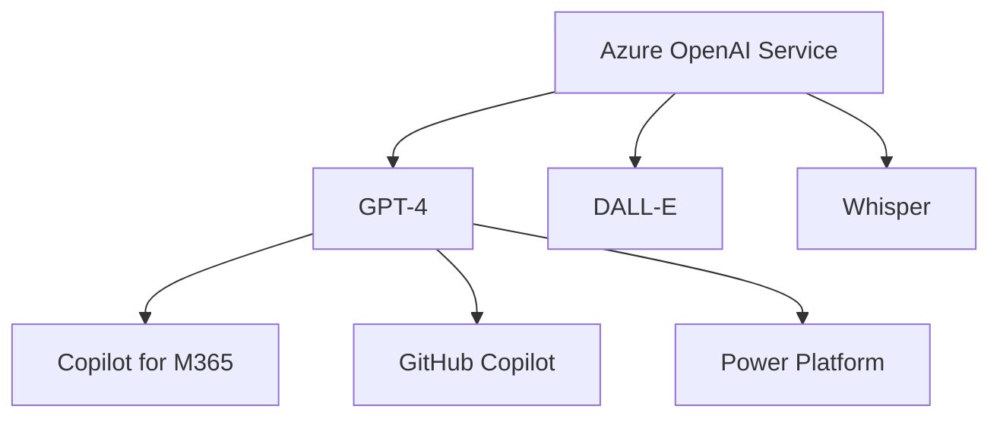
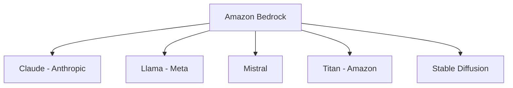
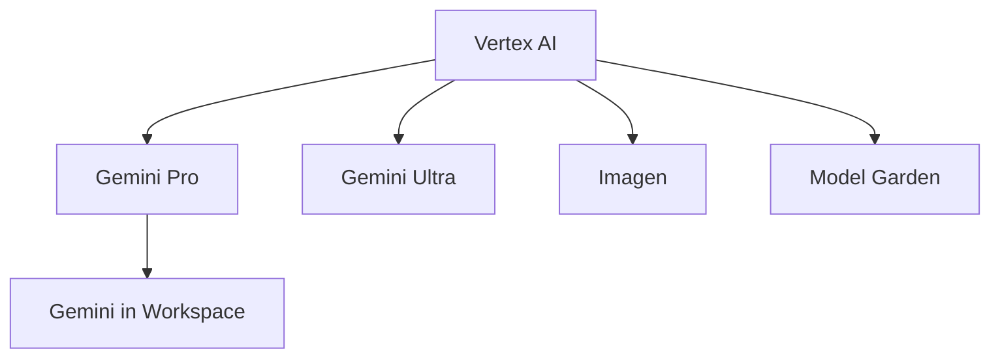
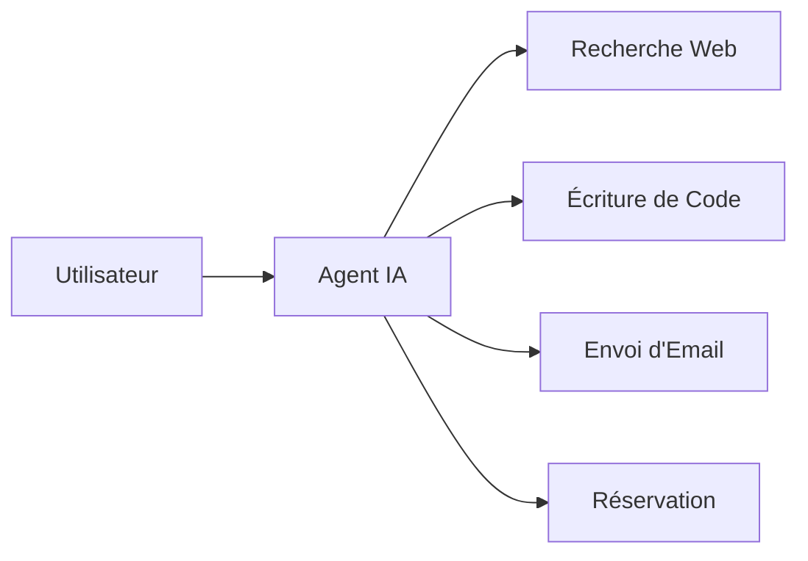

# Chapitre 37 — L'ère de l'IA générative

## Introduction

Depuis le lancement de ChatGPT en novembre 2022, l'IA générative a bouleversé l'industrie technologique. Les hyperscalers se livrent une bataille féroce pour dominer ce marché. Ce chapitre explore comment l'IA générative transforme le cloud et redéfinit les rapports de force.

---

## 1. Le séisme ChatGPT

### Chronologie
| Date | Événement | Impact |
| :--- | :--- | :--- |
| **Nov 2022** | Lancement ChatGPT | 1 million d'utilisateurs en 5 jours |
| **Jan 2023** | Microsoft investit $10B dans OpenAI | Partenariat exclusif Azure |
| **Fév 2023** | Google lance Bard (Gemini) | Réponse défensive |
| **Nov 2023** | AWS lance Bedrock + Amazon Q | Stratégie multi-modèles |

### Pourquoi c'est différent
| IA Classique | IA Générative |
| :--- | :--- |
| Classification, prédiction | Création de contenu nouveau |
| Spécialisée (un modèle = une tâche) | Généraliste (un modèle = mille tâches) |
| Nécessite des data scientists | Accessible via prompts naturels |
| Résultats structurés | Résultats en langage naturel |

---

## 2. La stratégie des hyperscalers

### Microsoft Azure : L'intégration totale

**Stratégie :** Intégrer l'IA dans tous les produits Microsoft.
**Avantage :** Accès exclusif aux meilleurs modèles OpenAI.

### AWS : Le marketplace de modèles

**Stratégie :** Ne pas dépendre d'un seul fournisseur de modèles.
**Avantage :** Choix et flexibilité.

### GCP : L'IA native

**Stratégie :** Développer ses propres modèles (Gemini).
**Avantage :** Intégration avec la stack data Google.

---

## 3. Les cas d'usage transformatifs

### Productivité individuelle
- **Copilot (Microsoft)** : Rédaction, analyse de données, présentations.
- **Duet AI (Google)** : Gmail, Docs, Sheets.

### Développement logiciel
- **GitHub Copilot** : Génération de code.
- **Amazon CodeWhisperer** : Suggestion de code dans l'IDE.

### Service client
- Chatbots intelligents remplaçant les FAQ.
- Résolution automatique de tickets.

### Création de contenu
- Génération d'images (DALL-E, Imagen, Midjourney).
- Génération vidéo (Runway, Sora).

---

## 4. Les défis

### Coûts de l'inférence
| Modèle | Coût approximatif |
| :--- | :--- |
| GPT-4 Turbo | $0.01 / 1K tokens input, $0.03 / 1K tokens output |
| Claude 3 Opus | $0.015 / 1K tokens input, $0.075 / 1K tokens output |
| Gemini 1.5 Pro | ~$0.00125 / 1K chars input |

À grande échelle, l'IA générative coûte **très cher**.

### Hallucinations
Les LLMs inventent des informations de manière confiante.
**Solution :** RAG (Retrieval Augmented Generation) avec vos données.

### Sécurité et confidentialité
- Les données envoyées aux LLMs peuvent fuiter.
- Nécessité de déploiements privés (Azure OpenAI, Bedrock).

---

## 5. L'avenir : Agents IA

La prochaine vague : des **agents autonomes** qui exécutent des tâches complexes.

Les hyperscalers préparent tous des frameworks d'agents.

---

## Ce qu'il faut retenir

> L'IA générative n'est pas une hype passagère. C'est une **révolution technologique** comparable à l'invention du web ou du smartphone.

Les entreprises qui maîtrisent l'IA générative auront un avantage compétitif massif. Le cloud est le seul moyen réaliste d'y accéder.
