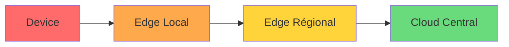
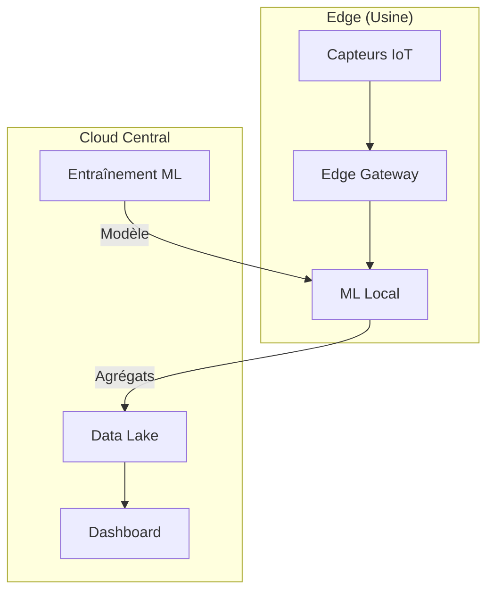

# Chapitre 38 — Edge computing et cloud distribué

## Introduction

Le cloud centralisé a ses limites. Quand la latence compte (voitures autonomes, usines, gaming), on ne peut pas attendre 100ms pour un aller-retour vers un datacenter distant. Le **Edge Computing** rapproche le calcul des utilisateurs et des objets connectés.

---

## 1. Définition et positionnement

### Le spectre du calcul

| Niveau | Latence | Exemple |
| :--- | :--- | :--- |
| **Device** | <1ms | Capteur IoT, caméra |
| **Edge Local** | 1-10ms | Passerelle usine, magasin |
| **Edge Régional** | 10-50ms | Antenne 5G, CDN |
| **Cloud Central** | 50-200ms | Datacenter AWS/Azure/GCP |

### Pourquoi l'Edge ?
| Contrainte | Solution Edge |
| :--- | :--- |
| **Latence** | Calcul proche = réponse rapide |
| **Bande passante** | Traitement local = moins de données à envoyer |
| **Résilience** | Fonctionne même si le cloud est inaccessible |
| **Souveraineté** | Données traitées localement |

---

## 2. Offres Edge des hyperscalers

### AWS
| Service | Description |
| :--- | :--- |
| **Outposts** | Racks AWS dans votre datacenter |
| **Local Zones** | Mini-régions proches des villes |
| **Wavelength** | AWS dans les antennes 5G |
| **IoT Greengrass** | Runtime pour devices IoT |

### Azure
| Service | Description |
| :--- | :--- |
| **Azure Stack Edge** | Appliance IA/ML en edge |
| **Azure IoT Edge** | Conteneurs sur devices |
| **Private MEC** | Edge chez les opérateurs télécoms |

### GCP
| Service | Description |
| :--- | :--- |
| **Distributed Cloud** | GCP n'importe où |
| **Edge TPU** | Chip IA pour l'inférence edge |
| **Anthos for Edge** | Kubernetes en edge |

---

## 3. Cas d'usage

### Industrie 4.0
- Détection de défauts en temps réel sur la ligne de production.
- Maintenance prédictive des machines.

### Retail
- Analyse vidéo en magasin (heat maps, comptage).
- Caisses autonomes.

### Véhicules autonomes
- Décisions de conduite en millisecondes.
- Impossible d'attendre le cloud.

### Gaming / Streaming
- Cloud gaming (Stadia, Luna, xCloud) nécessite des serveurs proches des joueurs.

---

## 4. Architecture type

**Pattern clé :** 
- Inférence ML en edge (rapide).
- Entraînement ML dans le cloud (puissance).
- Agrégation des données vers le cloud.

---

## 5. Défis

| Défi | Description |
| :--- | :--- |
| **Gestion** | Des milliers de devices à gérer vs quelques VMs |
| **Sécurité** | Devices physiquement accessibles (vol, manipulation) |
| **Mise à jour** | Déployer des updates sur des milliers de points |
| **Connectivité** | Fonctionner en mode déconnecté |

---

## Ce qu'il faut retenir

> Le futur n'est pas "tout dans le cloud" mais **le bon calcul au bon endroit**.

L'Edge computing est le complément naturel du cloud pour les cas où la latence, la bande passante ou la souveraineté sont critiques.
