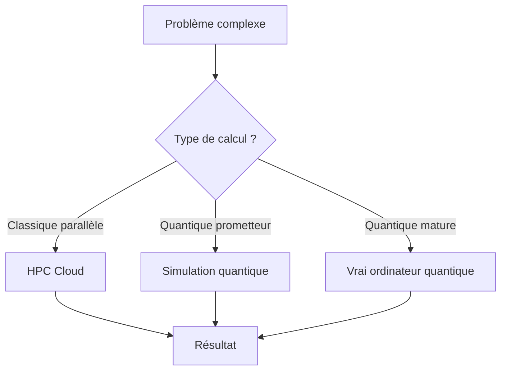

# Chapitre 39 — Cloud + HPC + Quantique

## Introduction

Le cloud ne se limite plus aux applications web. Il devient la plateforme de choix pour le **High Performance Computing (HPC)** et les expérimentations en **informatique quantique**. Ce chapitre explore ces frontières technologiques.

---

## 1. HPC dans le Cloud

### Définition
Le HPC (High Performance Computing) désigne l'utilisation de supercalculateurs pour résoudre des problèmes complexes :
- Simulations météo
- Modélisation moléculaire (pharmacie)
- Dynamique des fluides (aéronautique)
- Entraînement de modèles IA massifs

### Pourquoi le cloud pour le HPC ?

| Avant (HPC on-prem) | Maintenant (HPC cloud) |
| :--- | :--- |
| Achat du supercalculateur (~$100M) | Location à l'heure |
| Délai : 2 ans de construction | Délai : quelques minutes |
| Capacité fixe | Capacité élastique |
| Obsolescence matérielle | Toujours le dernier hardware |

### Offres HPC

| Cloud | Service HPC |
| :--- | :--- |
| **AWS** | ParallelCluster, Graviton, instances P5 (H100) |
| **Azure** | CycleCloud, instances HBv4, ND A100 |
| **GCP** | HPC Toolkit, instances A3 (H100), TPU v5 |

### Le cas de l'entraînement IA
Les LLMs nécessitent des clusters de milliers de GPUs.
- **GPT-4** : Estimé à ~25,000 A100 pendant des mois.
- Seul le cloud peut fournir cette capacité à la demande.

---

## 2. L'informatique quantique

### Qu'est-ce que c'est ?
Un ordinateur quantique utilise des **qubits** au lieu de bits classiques.
- Un bit classique = 0 ou 1.
- Un qubit = 0 ET 1 simultanément (superposition).

Cela permet de résoudre certains problèmes exponentiellement plus vite.

### Applications promises
| Domaine | Application |
| :--- | :--- |
| **Cryptographie** | Casser les algorithmes actuels (RSA) |
| **Optimisation** | Logistique, finance |
| **Chimie** | Simulation de molécules (médicaments) |
| **IA** | Algorithmes quantiques ML |

### État actuel (2024-2025)
Nous sommes à l'ère **NISQ** (Noisy Intermediate-Scale Quantum) :
- Quelques centaines de qubits.
- Très sensibles aux erreurs.
- Pas encore d'avantage quantique prouvé pour des problèmes réels.

---

## 3. Le quantique dans le cloud

Les hyperscalers proposent un accès au quantique via le cloud :

### AWS : Amazon Braket
- Accès à plusieurs technologies (IonQ, Rigetti, D-Wave).
- Simulateurs quantiques.
- SDK pour développer des algorithmes.

### Azure : Azure Quantum
- Partenariats avec IonQ, Quantinuum.
- Intégration avec Q# (langage quantique Microsoft).
- Ressource estimator (estimer les besoins avant d'exécuter).

### GCP : Quantum AI
- Google développe ses propres processeurs (Sycamore, Willow).
- Cirq : bibliothèque open source pour le quantique.
- Accès limité (recherche).

---

## 4. Convergence HPC + Quantique + Cloud

### Architecture hybride future
1. **Prétraitement classique** (Cloud).
2. **Calcul quantique** pour la partie critique.
3. **Post-traitement classique** (Cloud).

---

## 5. Préparer l'après

### Pour le HPC
- Apprendre les outils de parallélisation (MPI, CUDA).
- Expérimenter avec les instances GPU du cloud.

### Pour le quantique
- Apprendre les bases (superposition, intrication).
- Expérimenter avec les simulateurs (gratuits).
- Identifier les cas d'usage dans votre domaine.

---

## Ce qu'il faut retenir

> Le cloud démocratise l'accès au **supercalcul** et à l'**informatique quantique**.

Même si le quantique n'est pas encore mature, les hyperscalers investissent massivement. Les architectes cloud d'aujourd'hui doivent comprendre ces technologies pour être prêts demain.
