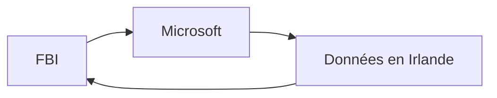

# Chapitre 40 — Le cloud comme infrastructure géopolitique

## Introduction

Le cloud n'est plus seulement une question technique. Il est devenu un **enjeu géopolitique majeur**. Les données sont le nouveau pétrole, et les hyperscalers américains contrôlent l'essentiel de l'infrastructure mondiale. Ce chapitre explore les implications et les réponses des États.

---

## 1. La domination américaine

### Parts de marché mondiales (2024)
| Fournisseur | Part de marché | Origine |
| :--- | :--- | :--- |
| AWS | 32% | 🇺🇸 USA |
| Azure | 23% | 🇺🇸 USA |
| GCP | 11% | 🇺🇸 USA |
| Alibaba Cloud | 4% | 🇨🇳 Chine |
| Autres | 30% | Mixte |

**66% du cloud mondial** est contrôlé par 3 entreprises américaines.

### Les implications
- Les données européennes transitent par des infras américaines.
- Les lois américaines (CLOUD Act) peuvent s'appliquer.
- Dépendance technologique stratégique.

---

## 2. Le CLOUD Act et ses conséquences

### Qu'est-ce que le CLOUD Act (2018) ?
Le **Clarifying Lawful Overseas Use of Data Act** permet aux autorités américaines d'exiger l'accès aux données d'entreprises américaines, **même si ces données sont stockées hors des USA**.

### Conflit avec le RGPD
| CLOUD Act | RGPD |
| :--- | :--- |
| Les USA peuvent exiger les données | Les données UE ne doivent pas quitter l'UE sans protection |

Les entreprises sont prises entre deux régulations contradictoires.

---

## 3. Les réponses européennes

### GAIA-X
Initiative franco-allemande pour créer un "cloud européen fédéré".
- Pas un cloud unique, mais des standards d'interopérabilité.
- Permet aux données de rester en Europe.
- Adoption lente.

### SecNumCloud (France)
Label de l'ANSSI pour le "Cloud de Confiance".
Exigences :
- Entreprise de droit européen.
- Pas de soumission aux lois extra-européennes.
- Hébergement en France.

### Les solutions "Bleu" et "S3NS"

| Solution | Partenaires | Technologie |
| :--- | :--- | :--- |
| **Bleu** | Microsoft + Orange + Capgemini | Azure |
| **S3NS** | Google + Thales | GCP |

**Principe :** La technologie est américaine, mais l'opérateur est français, coupant le lien juridique avec les USA.

---

## 4. La fragmentation du cloud mondial

### Le cas chinois
La Chine a son propre écosystème cloud, isolé :
- Alibaba Cloud
- Tencent Cloud
- Huawei Cloud

Les entreprises occidentales n'y ont pas accès, et vice-versa.

### Le découplage technologique
| Région | Clouds dominants |
| :--- | :--- |
| Amérique du Nord | AWS, Azure, GCP |
| Europe | AWS, Azure + Clouds souverains |
| Chine | Alibaba, Tencent, Huawei |
| Russie | Yandex Cloud |

Le "cloud mondial" devient des "clouds régionaux".

---

## 5. L'impact sur les entreprises

### Questions à se poser
1. **Où sont stockées mes données ?**
2. **Qui peut y accéder légalement ?**
3. **Quels sont mes risques réglementaires ?**
4. **Mon fournisseur cloud peut-il être sanctionné ?**

### Stratégies d'atténuation
| Stratégie | Description |
| :--- | :--- |
| **Chiffrement client-side** | Vous seul avez la clé |
| **Cloud souverain** | Pour les données les plus sensibles |
| **Data residency** | Contraindre la localisation des données |
| **Multi-cloud géographique** | Ne pas tout mettre chez un seul acteur |

---

## 6. L'avenir : Vers un cloud multipolaire ?

### Scénarios possibles
1. **Statu quo :** Domination US continue.
2. **Fragmentation :** Clouds régionaux isolés.
3. **Interopérabilité :** Standards ouverts (GAIA-X réussi).
4. **Souveraineté forte :** Chaque pays/bloc a son propre cloud.

### Tendance actuelle
Le mouvement vers plus de souveraineté s'accélère, mais la dépendance technologique reste forte.

---

## Ce qu'il faut retenir

> Le cloud est devenu une **infrastructure critique**, au même titre que l'énergie ou les télécoms.

Les architectes cloud doivent intégrer les contraintes géopolitiques dans leurs décisions : localisation des données, choix des fournisseurs, stratégies de sortie.

> [!IMPORTANT]
> La question n'est plus seulement "quel cloud est le meilleur techniquement ?" mais aussi "quel cloud est compatible avec mes contraintes juridiques et géopolitiques ?".
